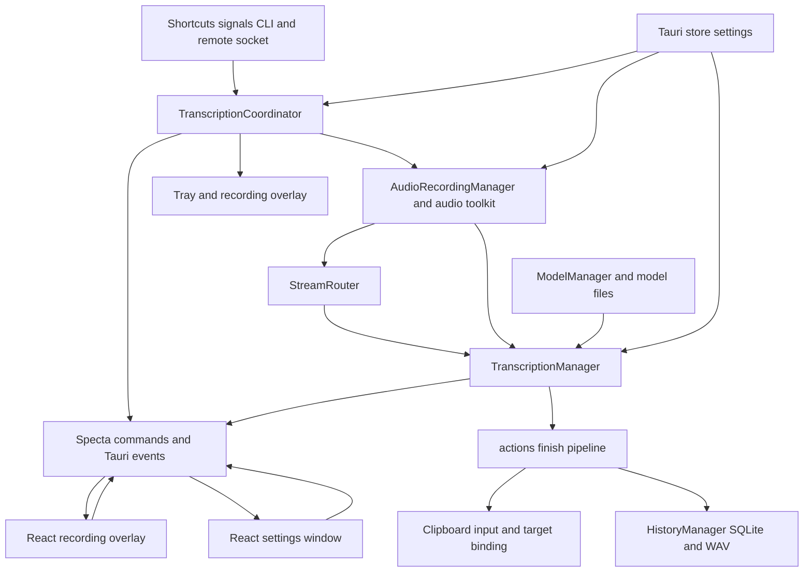

# System architecture and ownership

## Runtime shape

Handy is a Linux desktop process with a Rust/Tauri authority layer and two React/Vite webviews. `src-tauri/src/main.rs::main` parses `CliArgs`, disables WebKit DMABUF rendering, then calls `handy_app_lib::run`. `src-tauri/src/lib.rs::run` selects one of two compositions:

- **Desktop:** a programmatic `main` window, hidden `recording_overlay`, tray, signals, remote ingress, shortcuts initialized later by the frontend, and the full dictation runtime.
- **Headless:** `--transcribe-file`, `--list-devices`, or `--list-models` creates only `ModelManager` and `TranscriptionManager`, initializes native transcription backends and accelerator settings, runs a worker, unloads the model, flushes output, and calls `process::exit(code)`. It deliberately opens no microphone and creates no window, tray, overlay, signal handler, remote ingress, coordinator, history manager, or autostart effect.

The supported product and packaging target is Linux. Input capture, tray behavior, GTK layer shell, X11 or Wayland integration, and external audio tools are platform effects rather than portable abstractions.



*Component and data-flow boundaries in the desktop process; the coordinator serializes ownership while managers own resources and effects.*

## Composition and ownership

`run` installs Tauri plugins, mounts Specta events, registers the command handler, and manages `CliArgs`. In desktop setup it then:

1. Builds hidden webview `main` at `/`.
2. Loads settings and applies the runtime-only `--debug` override to log filters.
3. Manages `TranscriptionCoordinator::new` **before** external inputs are installed.
4. Calls `initialize_core_logic`.
5. Seeds the overlay-enabled atomic cache and prewarms accelerator enumeration.
6. Applies `--no-tray`, `start_hidden`, and `--start-hidden`; if no tray is available, it shows the main window even when hidden startup was requested.

`initialize_core_logic` clears stale overlay readiness first, then constructs managers in dependency order:

- `ModelManager::new`
- `TranscriptionManager::new(app, model_manager)`
- `AudioRecordingManager::new(app, transcription_manager.stream_router())`
- `HistoryManager::new`

It initializes transcribe-cpp before any model load, applies accelerator preferences, publishes all managers as Tauri state, starts `remote::RemoteIngress`, installs signal handling, builds the tray, synchronizes tray visibility and autostart from settings, and finally calls `overlay::create_recording_overlay`. Passing `Arc<StreamRouter>` directly into audio construction is intentional: always-on capture can route frames before all managed state is populated, and the audio callback avoids a Tauri lookup.

The principal authority boundary is `TranscriptionCoordinator`: local and remote triggers converge on one command channel, and `operation::OperationOwner` is carried through capture, processing, cancellation, and completion. Managers do not infer authority from the latest key or socket. See [Dictation pipeline](../runtime/dictation-pipeline.md) and [Remote and delivery](../runtime/remote-and-delivery.md).

Persistence and effects remain outside the coordinator:

- `settings` uses the Tauri store; model metadata and files belong to `ModelManager`.
- `HistoryManager` owns SQLite, pending WAV reservation, and history publication.
- `AudioRecordingManager` owns CPAL capture, VAD, microphone lifetime, and mute restoration.
- `TranscriptionManager` owns loaded inference engines, streaming workers, and model unload policy.
- `clipboard`, `input`, and `target_binding` own target-sensitive delivery.
- `tray`, `overlay`, and Tauri events expose state to operators.

Details live in [Models](../domains/models.md), [History and settings](../domains/history-settings.md), and [Frontend and IPC](../frontend/app-and-api.md).

## Native shell lifecycle

`tauri.conf.json` declares no static windows. `run` creates `main`; `overlay::create_recording_overlay` creates non-focusable `recording_overlay` using `src/overlay/index.html`. Vite builds both `index.html` and `src/overlay/index.html`; frontend entrypoints are `src/main.tsx` and `src/overlay/main.tsx`.

A second desktop invocation is handled by `tauri_plugin_single_instance`: `--toggle-transcription` routes to `signal_handle::send_transcription_input`, `--cancel` to centralized local cancellation, and other invocations show and focus `main`. Headless mode skips this plugin so a running desktop instance cannot turn a one-shot command into a silent no-op.

Window close is **close-to-hide**: `CloseRequested` is prevented and the window is hidden. Theme changes refresh the tray icon. The tray can reopen settings or quit, and startup refuses an unreachable hidden state when tray visibility is disabled. Settings synchronize autostart; CLI visibility flags are runtime overrides, not persisted settings.

On `RunEvent::Exit`, shutdown ordering is explicit: stop `RemoteIngress` first, then `TranscriptionManager::unload_model`. The headless worker similarly unloads before flushing stdout and stderr and exiting. `run_headless_guarded` converts worker panic into exit code `1`; invalid input uses `2`, and success uses `0`.

## Frontend boot boundary

`src/main.tsx` marks the platform as Linux, applies cached theme synchronously, starts settings-theme reconciliation, initializes i18n and the model store, then renders `App`. `App` reads onboarding state; only after onboarding is complete does it invoke `initialize_enigo` and `initialize_shortcuts` and refresh devices. This preserves the backend comment that input injection and shortcuts are frontend-gated rather than core-startup effects.

The overlay entry renders `RecordingOverlay`, installs all overlay listeners, and only then invokes `mark_dictation_overlay_ready`. External mode bridges must wait for that marker; startup clearing prevents a previous process from appearing ready.

## Invariants and failure behavior

- The coordinator exists before remote, signal, or shortcut input can acquire operation ownership.
- Native transcription backend registration and accelerator setup precede every first model load.
- Headless stdout remains result-only; console logs move to stderr.
- A desktop close hides; process teardown occurs only through application exit.
- A hidden startup always retains a tray route back to the UI.
- Remote ingress failure is logged and degrades only remote dictation; manager construction failures are startup-fatal.
- Repository tests establish state and ordering contracts, not live microphone, GPU, X11 focus, GTK layer-shell, tray, or package-runtime behavior.

## Task-oriented source map

| Change | Owning entrypoints and symbols | Also inspect |
|---|---|---|
| Startup composition | `main.rs::main`, `lib.rs::run`, `initialize_core_logic` | `cli.rs::CliArgs`, `tauri.conf.json` |
| Window or visibility lifecycle | `show_main_window`, `run` window-event handler, `overlay::create_recording_overlay` | `tray.rs`, autostart setting commands |
| Dictation ownership | `TranscriptionCoordinator`, `Stage`, `OperationOwner` | `actions.rs`, managers |
| IPC surface | `collect_commands!`, `collect_events!`, Specta export | `src/bindings.ts`, capabilities |
| Frontend boot | `src/main.tsx`, `App`, `src/overlay/main.tsx` | Vite multi-entry config |
| Exit cleanup | `RunEvent::Exit`, headless worker | `RemoteIngress::shutdown`, `TranscriptionManager::unload_model` |
| Build or packaging | `package.json`, `Cargo.toml`, `tauri.conf.json` | [Build, install, and check](../operations/build-install-check.md) |

## Focused tests and narrow validation

From the repository root:

```bash
cargo test --manifest-path src-tauri/Cargo.toml headless_guard_tests
cargo test --manifest-path src-tauri/Cargo.toml transcription_coordinator::tests
bun run build
```

The first command checks exit-code and panic normalization; the second checks exclusive local and remote ownership, stale completion rejection, and input timing rules. `bun run build` type-checks and builds both Vite entries. Use a real desktop session only for the narrower integration questions: close-to-hide, no-tray visibility, single-instance forwarding, overlay placement, autostart, and clean native backend teardown.
