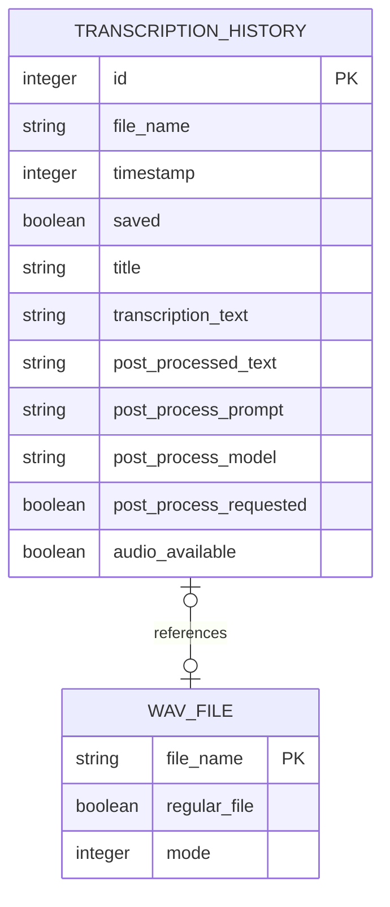
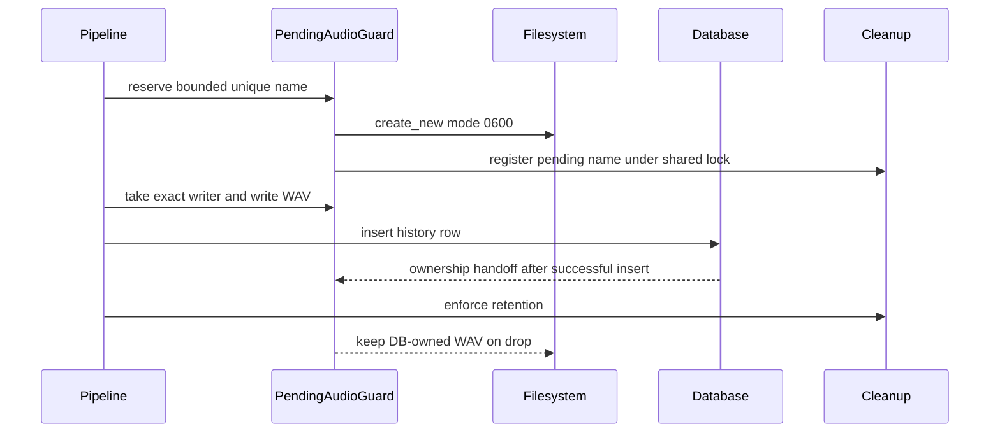

# History durability and settings ownership

The backend is authoritative for both domains: `HistoryManager` owns `history.db` plus `recordings/`, while `settings.rs` owns the `settings` object in `settings_store.json`. The React UI consumes generated IPC types; it is not a second persistence layer. For pipeline context, see [Dictation pipeline](../runtime/dictation-pipeline.md); model-specific settings are detailed in [Models](models.md).

## History schema and lifecycle

`transcription_history` is advanced by six ordered `rusqlite_migration` migrations tracked in `PRAGMA user_version`. Migration 1 creates `id`, `file_name`, Unix-second `timestamp`, `saved`, display `title`, and raw `transcription_text`; migrations 2–6 add nullable `post_processed_text`, nullable `post_process_prompt`, `post_process_requested` (default false), nullable `post_process_model`, and `audio_available` (default false). Startup converts successful legacy `_sqlx_migrations` state to `user_version` before applying pending migrations.



The row may outlive its WAV, and a retained WAV row may have its private text purged; `audio_available`, not mere `file_name`, is the UI contract.

`HistoryEntry` mirrors all columns. A successful new take inserts the pre-output-conversion ASR text into `transcription_text`, starts unsaved, records whether a regular single-component WAV exists, and emits typed `HistoryUpdatePayload::Added`. Retry is intentionally asymmetric: it retranscribes retained audio, runs `process_transcription_output`, writes `processed.final_text` into `transcription_text`, clears all legacy second-pass metadata, applies retention, then emits `Updated` if the row remains. Therefore “raw transcription” describes new-take insertion, not necessarily a retried row. Cleanup and manual deletion emit `Updated` or `Deleted`; save toggling emits `Toggled`. Current takes never run an LLM/provider second pass; historical metadata columns remain only for old-row readability.

### Exclusive WAV ownership



*The pending guard exclusively owns teardown until a successful database insert transfers ownership to history.*

The reservation name is `handy-{milliseconds}-{pid}-{nonce}.wav`, with 64 bounded attempts. A shared mutex spans `create_new` and pending registration, so orphan cleanup cannot observe a newly published but unregistered file. The guard remembers device/inode identity, accepts only a safe single `.wav` name, and creates owner-only mode `0600`. If writing, insertion, cancellation, or panic occurs before handoff, `Drop` closes and deletes only that exact inode; it refuses to delete a replaced path. Immediately after a successful row insert—and before policy cleanup—the guard marks the WAV history-owned.

At startup, `HistoryManager::new` creates `recordings/`, migrates the DB, reconciles every `audio_available` value against a regular non-symlink file, removes untracked regular WAVs while preserving tracked and pending names, and enforces retention. Orphan deletion rechecks SQLite immediately before unlinking. Filesystem cleanup failures are logged and retried later; database errors remain fatal. Manual deletion removes audio first and refuses to delete the row when unlinking fails.

## Retention semantics

Audio and text are independent:

- `recording_retention_period`: `never`; `preserve_limit`; or unsaved audio older than `days3`, `weeks2`, or `months3`. `preserve_limit` keeps the newest `history_limit` audio rows by `(timestamp, id)` and **does not exempt saved rows**. Time policies exempt `saved` audio.
- Text-pair retention is a fixed 1,000 successful pairs, where raw text, post-processed text, and exact prompt are all non-empty. Beyond 1,000, rows with retained audio remain but raw/output/prompt/model/request metadata is erased; rows without audio are deleted.
- Failed or raw-only rows remain while their audio remains, then disappear. `saved` is therefore a time-policy audio pin and a UI marker, not an unlimited text/archive guarantee.
- Changing `history_limit` or recording retention persists the setting and immediately runs cleanup. A limit of zero can remove a just-inserted incomplete/raw-only row before an `Added` event is sent.

## History API and UI

`get_history_entries(cursor, limit)` uses descending ID keyset pagination, clamps a supplied limit to 100, fetches one extra row for `has_more`, and returns all rows if no limit is supplied. The History page requests 30 at a time and uses an `IntersectionObserver`. It subscribes through the generated typed history event, prepending adds and reconciling updates/deletes; `Toggled` is intentionally handled only by its optimistic local change.

Per-row actions are: copy raw `transcription_text`; optimistic save/unsave with rollback; lazy playback by resolving the path, reading it through the scoped FS plugin, and creating a WAV object URL; retry only when `audio_available`; and optimistic delete with a full first-page reload on failure. “Open recordings” delegates to the backend opener. The UI currently displays raw text even though history may also contain post-processed text; the tray deliberately prefers post-processed text (see [Native operator surface](../frontend/app-and-api.md#native-operator-surface)).

## `AppSettings`: store, defaults, and migration

`#[serde(default)]` on `AppSettings` makes missing fields use backend defaults. Enums use serde's source-defined snake-case/string representation unless an enum has an explicit compatibility deserializer (for example `LogLevel` also accepts legacy integers). A new field needs a typed field, a `default_*` function or explicit serde default, and a matching value in `AppSettings::default`/`get_default_settings`; bump `settings_schema_version` and add a gated transformation only when old persisted values require conversion.

`get_settings` opens `settings_store.json`, key `settings`; creates defaults when absent; salvages individually valid top-level fields when whole-object deserialization fails; tolerates unknown keys for downgrade/forward compatibility; applies idempotent migrations; merges newly introduced default bindings; and writes the repaired, merged, or migrated object back. Salvage logs field names only, never values. `write_settings` replaces the whole `settings` value, so all writers must read-modify-write a complete `AppSettings`.

Current schema version is 1. One-time migrations: infer missing `onboarding_completed` from an explicitly selected model; reset ambiguous legacy positive GPU ordinals to accelerator `auto` and device `-1`; and, only when `overlay_style` is absent, map legacy `overlay_position: none` to style `none`, otherwise style `live`. Legacy position `none` deserializes as `bottom` so it cannot poison the whole store. Numeric legacy log levels 1–5 deserialize alongside `trace`–`error` strings.

### Authoritative defaults and setting families

Defaults come only from Rust `get_default_settings`; the frontend fetches them for reset controls.

- **Shortcuts:** `transcribe=ctrl+space`, `cancel=escape`; `push_to_talk=true`; implementation `tauri`. Missing default bindings are merged on read.
- **App/shell:** `start_hidden=false`, `autostart_enabled=false`, `show_tray_icon=true`, theme `system`, onboarding incomplete, debug and experimental modes false.
- **Model/language:** no selected model; language `auto`; translate false; unload after `min5`; transcribe and ORT accelerators `auto`; GPU device `-1`.
- **Capture:** on-demand microphone, no selected input/output device, no mute, VAD true, zero extra recording buffer, lazy stream close false.
- **Feedback/overlay:** feedback false, volume `1.0`, sound `marimba`; overlay style `none`, position `bottom`.
- **Text/delivery:** no custom words, optional filler words absent, correction threshold `0.18`, paste method `direct`, typing tool `auto`, no external script, clipboard `dont_modify`, auto-submit false with `enter`, no trailing space, Herdr binding true, pre/post paste delays 60 ms.
- **History/logging:** history limit 5, audio retention `preserve_limit`, log level `debug`.

The UI families cover every operator-facing field:

| Page | Controls and conditional surfaces |
|---|---|
| General | Transcribe binding, push-to-talk, selected model’s language/translation, input device, mute while recording, audio feedback, output device, volume. |
| History | Paginated entries, copy, saved marker, retry, playback, deletion, recordings folder. |
| Models | Search/language filtering, rescan, download/cancel/delete/select and progress; see [Models](models.md). |
| Advanced / App | Start hidden, autostart, tray visibility, overlay style/position, unload timeout, experimental toggle. |
| Advanced / Output | Paste method and optional script, direct-typing tool, clipboard handling, auto-submit key/off, Herdr binding. |
| Advanced / Transcription | VAD, custom words, trailing space. |
| Advanced / History | History count and recording retention. |
| Advanced / Experimental | Keyboard backend, transcribe/ORT acceleration and GPU device, lazy stream close; visible only when experimental mode is enabled. |
| Debug | Log level, sound theme/custom sound tests, correction threshold, both paste delays, recording buffer, always-on microphone, live logs; page visible only in debug mode. |
| About | Theme, version/source link, app-data and log directories. |

`custom_filler_words` is persisted and consumed by backend text processing but has no current control/updater. `selected_model` and `onboarding_completed` are changed by model commands rather than generic settings updates; `settings_schema_version` is migration-owned. Sound files are documented under [Audio feedback](../frontend/app-and-api.md#audio-feedback).

## Frontend optimistic ownership and hazard

`useSettingsStore` initializes defaults, current settings, and custom-sound presence in parallel; audio devices are deliberately deferred until onboarding completes. It normalizes absent device selections to display `Default`, maps each mutable key to a purpose-built command, optimistically updates local state, tracks per-key pending state, and attempts rollback on thrown errors. If `settingUpdaters` has no entry for a key, `updateSetting` rejects the update rather than pretending it was persisted; intentionally command-owned fields such as `selected_model` are excluded. Binding changes are stronger: they inspect both the generated outer `Result` and `BindingResponse.success` before accepting the optimistic value.

**Known hazard:** most `settingUpdaters` merely `await` generated command wrappers. Tauri/Specta command failures resolve as `{status: "error"}` rather than throwing, so these paths can leave an optimistic value displayed even when the backend rejected it. New code should inspect `status`, throw on error, and preferably refresh authoritative settings after side-effecting commands. Multi-command controls such as accelerator/device and auto-submit/key are not transactional.

## Safe extension recipes

### Add a setting

1. Add the typed field and explicit serde/default behavior in `settings.rs`; update `get_default_settings` and schema version/migration if existing values need transformation.
2. Add or reuse a command that validates, persists by complete read-modify-write, and applies runtime side effects. Register it in the single Specta `collect_commands!` list.
3. Add the frontend updater and control; handle the generated `Result.status`, rollback/refresh on failure, and place conditional UI under the correct page gate.
4. Regenerate `src/bindings.ts` with a debug Rust build, then test missing-field parsing, invalid-field salvage, migration idempotence, runtime side effects, lint, and build.

### Add a history migration

Append—never reorder or rewrite—one `M::up` after the six existing migrations; update `HistoryEntry`, all explicit SELECT/INSERT mappings and test schemas/fixtures; reconcile filesystem-derived truth if the default cannot describe old rows; update generated bindings if the public type changes; and test a pre-migration DB reopened through latest migrations plus cleanup/retry behavior.

## Focused validation

```bash
cd src-tauri && cargo test managers::history::tests
cd src-tauri && cargo test settings::tests
python3 -m unittest tests.test_install_local_settings
bun run lint
bun run build
```

Named history cases include `migration_reconciles_present_and_absent_audio_under_never_after_restart`, `migration_reconciles_present_and_absent_audio_under_count_after_restart`, `exclusive_audio_reservation_skips_owned_collision_without_mutation`, `uncommitted_reserved_audio_is_removed_immediately`, `pending_audio_is_ignored_until_its_history_row_exists`, `orphan_cleanup_reports_removal_failure_and_retries`, `count_audio_removal_failure_returns_error_keeps_truth_and_retries`, `exact_pair_metadata_and_latest_query_survive_reopen`, and `get_latest_completed_entry_skips_purged_and_empty_entries`. Together they pin restart reconciliation, reservation/guard safety, cleanup policy and failure retry, and latest-entry ordering.

Named settings cases are `empty_store_parses_with_defaults`, `salvage_preserves_valid_fields_when_one_value_is_invalid`, `salvage_of_poisoned_bindings_keeps_other_fields`, `salvage_tolerates_unknown_keys`, `overlay_migration_keeps_disabled_overlay_off`, and `gpu_device_migration_keeps_current_schema_positive_selection`. They pin empty/default, corrupt-field, poisoned-binding, unknown-key, legacy-overlay, and current-schema idempotence behavior. Installer tests validate a deployment policy that preserves unrelated state while intentionally forcing local defaults; that policy is operational, not the application default.

## Scope boundaries

Repository tests use temporary SQLite/filesystem state; they do not prove durability across power loss, unusual network filesystems, real audio playback, or desktop portal permissions. There is no frontend unit suite, and generated types do not validate raw event payloads at runtime. App-data content can contain recordings and transcripts: do not place it in logs, fixtures, or bug reports without redaction.
