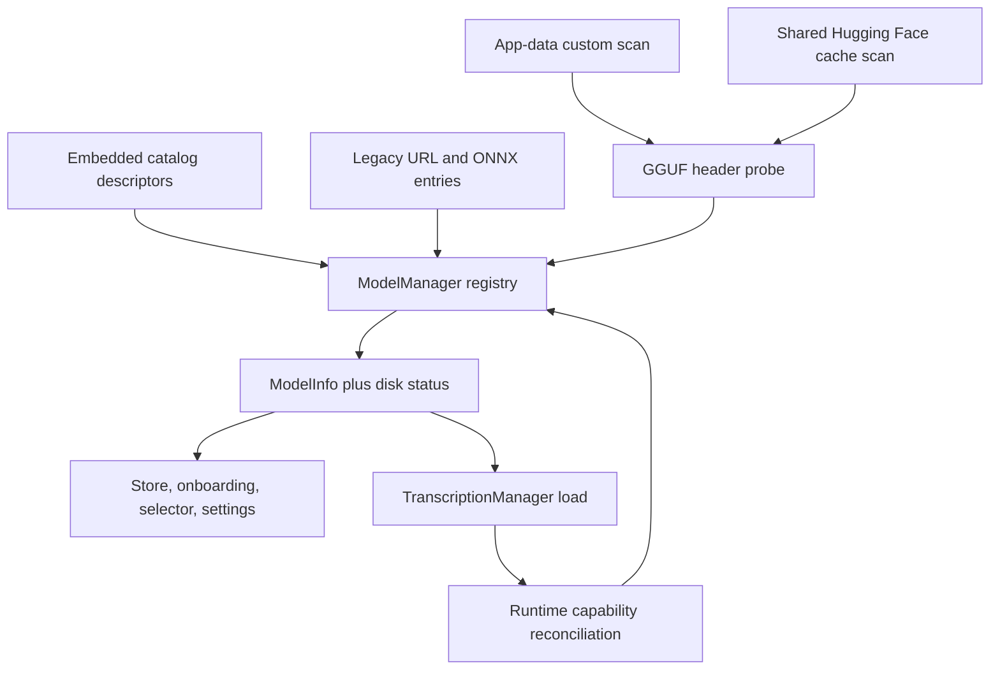
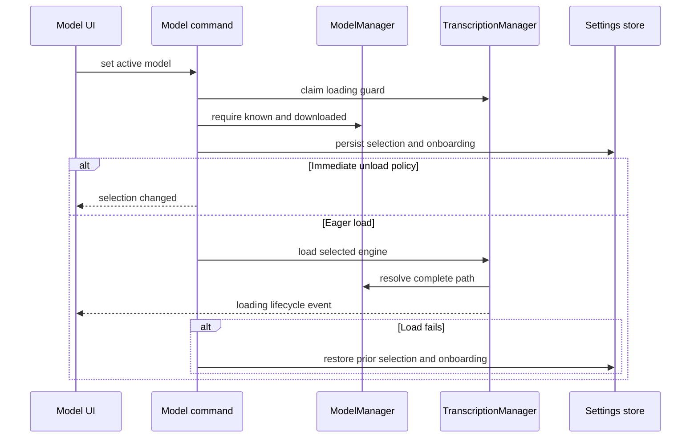

# Models, capabilities, language, and acceleration

`ModelManager` owns the available-model registry and files; `TranscriptionManager` owns the single loaded engine and its stream lease. Commands and `modelStore` expose those authorities to onboarding, model settings, and the selector. Audio-to-text execution continues in [Dictation pipeline](../runtime/dictation-pipeline.md); settings persistence and salvage are in [History and settings](history-settings.md).

## Domain contract and entrypoints

### Public types

| Type | Schema and meaning |
|---|---|
| `EngineType` | `TranscribeCpp`, `Parakeet`, `Moonshine`, `MoonshineStreaming`, `SenseVoice`, `GigaAM`, `Canary`, `Cohere`. It selects the loader and transcription adapter. `TranscribeCpp` is architecture-driven and covers Whisper, Parakeet, Voxtral, Qwen3-ASR, Nemotron, and other GGML/GGUF families supported by transcribe-cpp. |
| `ModelSource` | `Url {url, sha256?}`, `HuggingFace {repo_id, revision}`, or `Local`. It selects download and path resolution; `Local` cannot be downloaded. |
| `ModelInfo` | Identity/name/description/filename/source/size; disk flags `is_downloaded`, `is_downloading`, `partial_size`, `is_directory`; engine; normalized accuracy/speed; recommendation/custom flags; translation, streaming, language-selection/detection capabilities and language list. This is the Specta/TypeScript consumer contract. |
| `ModelDescriptor` + `DiskStatus` | Static normalized catalog description versus recomputable disk state. Descriptor default quant is named `default_quant`, otherwise the first `files[]` item. |
| `CapabilityProbe` | `Compatibility` (`compatible`, `maybe_incompatible`, `unsupported`, `unknown`) plus optional display name, architecture, variant, languages, streaming, translation, and language-detection values. `None` means unknown, not false. |
| `DownloadProgress` | `{model_id, downloaded, total, percentage}` emitted during URL and HF transfers. |
| `ModelLoadStatus` | `{is_loaded,current_model}`. Loaded status also counts an engine temporarily leased to the stream worker. |
| Accelerator settings | transcribe-cpp: `auto`, `cpu`, `gpu` plus signed GPU device index (`-1` automatic). ORT: `auto`, `cpu`, `cuda`, `rocm`. `AvailableAccelerators` returns transcribe strings, ORT strings, and GPU options with index/name/VRAM. |

Primary Tauri commands are `get_available_models`, `get_model_info`, `rescan_local_models`, `download_model`, `cancel_download`, `delete_model`, `set_active_model`, `get_current_model`, `get_transcription_model_status`, `is_model_loading`, `get_model_load_status`, `unload_model_manually`, `set_model_unload_timeout`, and the settings/availability commands for language and accelerators. Registration and generated binding mechanics are cataloged in [Frontend and IPC](../frontend/app-and-api.md).

## Registry, discovery, and storage

`ModelManager::new` creates `<app-data>/models`, seeds legacy URL/ONNX entries, adds the compiled offline `catalog/catalog.json`, migrates old bundled/GigaAM layouts, discovers custom files and the shared Hugging Face cache, computes status, and may auto-select an available model. Registry list order is catalog editorial rank, recommended flag, descending accuracy, descending speed, then name.

The catalog is generated by `ops/build/gen_catalog.py`, embedded with `include_str!`, and normalized to `ModelDescriptor`. Catalog IDs are `repo_id/default_filename`, deliberately matching HF-cache discovery for deduplication; scores convert 0–100 to 0–1. Catalog GGUFs and legacy URL models remain separate. The frontend hides legacy URL downloads that are not already present, but downloaded legacy models remain runnable.

Custom app-data and HF-cache discovery is additive. Local `.gguf` headers supply display/capability metadata; legacy `.bin` or unreadable metadata exposes conservative capabilities and is corrected after a successful transcribe-cpp load. Rescan is single-flight, performs disk/header work off the registry lock, preserves existing/runtime-corrected entries, recomputes disk flags, auto-selects if needed, and emits `models-updated`. A rescan racing a transfer may briefly clear display-only `is_downloading`; it does not cancel the transfer.



*Multiple producers normalize into one registry; loaded transcribe-cpp metadata can overwrite pre-load capability claims.*

### Capability and GGUF bounds

`GgufHeaderProber` requests only `general.architecture`, `general.name`, `stt.variant`, `general.languages`, and three `stt.capability.*` booleans. It reads 64 KiB initially and grows to at most 16 MiB, never tensor data. The parser bounds strings at 64 MiB, arrays at 16 Mi elements, retained arrays at 4,096 elements, and KV count at 1,000,000. Invalid magic/version/layout is `unsupported`; a parsed unknown/missing architecture is `maybe_incompatible`.

`KNOWN_ARCHES` currently includes Whisper, Parakeet, Qwen3-ASR, Voxtral and realtime, Cohere ASR, Canary variants, Moonshine variants, SenseVoice, GigaAM, Granite speech variants, FunASR Nano, and MedASR identifiers. Keep it synchronized with transcribe-cpp: absence changes compatibility presentation, not necessarily loader capability.

## Downloads, verification, deletion

- **HF source:** public unauthenticated `hf-hub` API, shared stock cache (`HF_HOME` or default), revision and filename from `ModelSource`, up to eight parallel file connections, progress throttled to about 10 Hz. Cancellation preserves hf-hub `.sync.part` for resume.
- **URL source:** app-data `filename.partial`, HTTP Range resume, restart from zero when a server ignores Range, status and expected byte-count checks, progress at about 10 Hz, optional SHA-256 in a blocking task, then rename. A hash/size failure removes unsafe partial data.
- **Directory archives:** verify first, unpack to `.extracting`, then rename into the final directory; extraction failure removes temporary/corrupt data and emits a structured failure.
- **Guards:** per-model cancellation tokens and `DownloadCleanup` clear flags/tokens on every error. `Local` has no download route. `get_model_path` refuses incomplete/downloading state.
- **Deletion:** unloads and clears settings first when deleting the active model. HF deletion removes the whole matching shared-cache repository by product decision; custom models disappear from the registry; catalog/legacy entries remain but become not downloaded. Missing files are errors.

Events consumed by `modelStore`/components are `model-download-progress`, `model-download-complete`, `model-download-failed`, `model-download-cancelled`, verification start/completed, extraction start/completed/failed, `model-deleted`, `models-updated`, and `model-state-changed`. The store merges backend transfer flags with optimistic state, derives speed, cleans up on command exceptions as well as events, and refreshes models/current selection after lifecycle events.

## Selection, loading, and unloading invariants

`switch_active_model` atomically claims `LoadingGuard`; concurrent tray/UI loads fail with `Model load already in progress`. It requires a known downloaded model, saves old selected/onboarding values, writes the new selection and `onboarding_completed=true` before events, and then:

- with unload policy `Immediately`, emits `selection_changed` and defers loading to next transcription;
- otherwise loads now; failure restores both persisted values.

This is transactional for settings, not engine memory: loading intentionally drops the old engine and current ID before constructing the new one to avoid double peak memory. If construction fails, no engine is loaded even though persisted selection rolls back. `load_model` emits `loading_started`, `loading_completed`, or `loading_failed`; engine panic is caught by the transcription path, the stale engine is dropped, an unload event is emitted, and next use reloads.



*Selection persistence rolls back on eager-load failure, while the old in-memory engine is deliberately not retained.*

`LoadedEngine` has one variant per `EngineType`; ONNX-backed loaders use their engine-specific models/quantization, while transcribe-cpp selects backend/device at load, creates a reusable session, and reconciles runtime streaming/translation/detection/languages into `ModelManager`. Empty runtime language lists do not erase a known catalog/probe list. Streams lease the engine outside its mutex; worker IDs prevent stale cleanup from clearing a newer worker, and model switch/unload causes a returned stale engine to be dropped.

Unload policies are `never`, `immediately`, 2/5/10/15 minutes, 1 hour, and debug-only 15 seconds. A 10-second watcher refreshes activity while recording and never unloads mid-session; `Immediately` is handled only after transcription/finalization/empty audio. Manual unload clears engine/ID and emits `unloaded`. Shutdown joins the watcher.

## Language, scripts, translation, and capabilities

The persisted `selected_language` is **intent**, never rewritten when switching models. `effective_language` is recomputed at each stream/batch use:

1. Empty advertised list preserves the intent.
2. A concrete intent matches by base BCP-47 subtag but returns the model's concrete locale (`en` to `en-US`).
3. `zh-Hans`/`zh-Hant` remain as script intent when Chinese is supported; the engine receives `zh`, then post-processing converts output to the requested Simplified/Traditional script.
4. Unsupported intent becomes `auto` only if detection is supported; otherwise prefer an advertised English locale, then the first language (Chinese script advertisements canonicalize to `zh`).

The language UI mirrors this base matching, offers Auto only when `supports_language_detection`, and limits choices to current model capabilities. `supports_language_selection` is true only when more than one canonical language is known.

For transcribe-cpp, translation to English runs only when requested, the loaded model advertises translation, and source language is not English; target is English and unsupported translation is not guessed. Initial prompts/custom words are attached only when the loaded model supports that feature. Streaming is likewise gated by **loaded runtime capability**; unsupported or failed stream startup idles until finalization and the batch path remains authoritative. Text normalization/filler-word and Chinese conversion failures are fail-open to raw transcription; engine/load failures are errors.

## Acceleration

`init_transcribe_backend` initializes transcribe-cpp. For its models, `auto` lets the library choose, `cpu` forces CPU, and `gpu` selects GPU with a persisted device index only when still valid; otherwise device resolution returns automatic. `--device-index` can hard-select one transcribe-cpp registry device for a single headless load without persisting it. `current_backend` reports the bound transcribe-cpp backend or `onnx` for other engines.

ORT preference is process-global through transcribe-rs: `auto`, `cpu`, `cuda`, or `rocm`. `get_available_accelerators` reports host/build availability rather than promising successful model execution. The settings UI combines transcribe accelerator and device as `auto`, `cpu`, or `gpu:N`, and separately selects ORT. A settings change marks the cached model for reload on next use rather than interrupting current transcription; loading reapplies both preferences. Stored invalid GPU selection is salvaged to automatic during settings load.

GPU/ORT/Vulkan/CUDA/ROCm availability, VRAM reporting, driver compatibility, and actual offload require host validation; static tests only establish mapping and fallback policy.

## Onboarding and frontend surfaces

`Onboarding` partitions non-downloaded, non-legacy catalog models into top curated recommendations, other recommendations, and the remaining list; already-downloaded models are selectable immediately. `ModelCard` displays recommendation, engine, normalized accuracy/speed, languages, translation/streaming capabilities, status, progress, and cancel/select actions. When the chosen download completes—including extraction—the flow selects it; successful `set_active_model` marks onboarding complete through the backend transaction.

`ModelsSettings` adds search, language filtering, rescan, downloaded/available sections, delete, download/cancel, and selection. `ModelSelector` lists downloaded models, tracks loading lifecycle, avoids auto-switching while recording, and can auto-select a just-completed download. `modelStore.initialize` must install event listeners once and load both registry and current selection. There is no frontend unit suite; backend contracts and a production frontend build are the guardrails.

## Failure behavior and extension surfaces

- Catalog JSON is compile-time trusted and panics at startup if its schema is invalid; generator/catalog tests are mandatory release checks.
- Registry/probe values are advisory until load. Unknown fields stay unknown; unsupported/malformed GGUFs are not promoted to compatible.
- Download command errors also emit `model-download-failed`; cancellation is a normal unwind preserving resumable partials. Event emission is best-effort, so callers/store also reconcile command results.
- A load can fail for absent files, incompatible model, backend/device, memory, or engine construction; selection rollback does not resurrect the dropped old engine.
- Deleting HF content affects other tools sharing that cache. Never broaden path removal without ownership/path tests.

To add an **engine**, change `EngineType`, `LoadedEngine`, loader, batch/stream dispatch and capability/language behavior, model definitions/catalog generation, Specta bindings, UI labels/cards, packaging dependencies, and focused manager tests. To add a **source**, change `ModelSource`, status/path/download/delete routing, progress/cancel cleanup, frontend legacy/source predicates, and tests. To add a **capability**, change catalog schema/generator, `CapabilityProbe` and GGUF keys/parser bounds, `ModelDescriptor`/`ModelInfo`, runtime reconciliation, gating/UI, generated bindings, and tests. To add a **language/script rule**, change backend effective-language logic and mirrored frontend constants/matching. To add an **accelerator**, change settings enum/default/salvage, backend mapping/availability, reload semantics, settings commands/UI, generated bindings, and host-conditional tests.

## Focused tests and narrow validation

```bash
cargo test --manifest-path src-tauri/Cargo.toml catalog::tests
cargo test --manifest-path src-tauri/Cargo.toml managers::gguf_meta::tests
cargo test --manifest-path src-tauri/Cargo.toml managers::model_capabilities::tests
cargo test --manifest-path src-tauri/Cargo.toml managers::model::tests
cargo test --manifest-path src-tauri/Cargo.toml managers::transcription::tests
cargo test --manifest-path src-tauri/Cargo.toml commands::models::tests
bun run build
```

High-value named tests are `test_discover_custom_transcribe_models`, `test_discover_hf_cache_models_filters_by_arch`, `test_verify_sha256_fails_and_deletes_partial_on_mismatch`, and `test_effective_language_resolves_bare_intent_to_concrete_locale`. Use catalog/probe/model tests for descriptor, discovery, language, download, and filesystem changes; add transcription tests for loader, streaming, translation, unload, panic, or accelerator changes. Run `bun run lint` when touching store/components or generated bindings. There is no frontend unit suite for event cleanup: `modelStore` command-exception cleanup and event reconciliation are guarded by TypeScript/Vite build plus focused manual cancellation/failure checks. Narrow manual validation should download/cancel/resume one affected source, verify checksum/extraction and event cleanup, switch successfully and through a forced load failure, rescan a custom GGUF, and confirm effective language/capabilities after load. Hardware acceleration claims require testing the intended host and model, not merely `get_available_accelerators` output.
