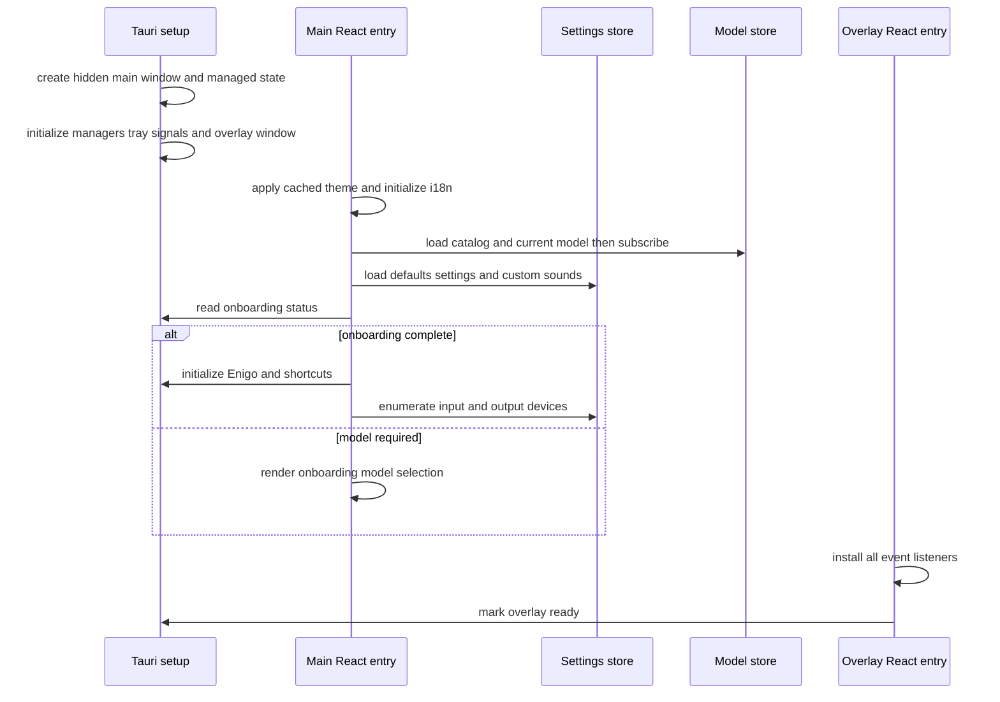

# React application, IPC API, CLI, events, and native shell

This page is the public operator and extension map. The product has two Vite/React entries and one Rust/Tauri composition root; it has no client-side router and no frontend unit suite. Domain behavior belongs in [Dictation pipeline](../runtime/dictation-pipeline.md), [History and settings](../domains/history-settings.md), [Models](../domains/models.md), and [Remote delivery](../runtime/remote-and-delivery.md).

## Application boot and composition



`main.tsx` fixes the platform marker to Linux, synchronously applies a cached theme to avoid flash, starts async settings-theme reconciliation, initializes i18n, initializes the model Zustand store before render, then mounts `App` under `StrictMode`. `useSettings` triggers its store once: Rust defaults, current settings, and custom-sound presence load in parallel. The model store loads models/current selection before installing raw model listeners and guards duplicate initialization.

`App` separately calls `getAppSettings` for the onboarding gate. Missing, false, or failed reads render model onboarding; starting model selection advances to the app. Only after the `done` state, once per mount, it calls idempotent `initializeEnigo` and `initializeShortcuts`, then enumerates microphones and output devices. This sequencing prevents shortcut/input setup and device probing during onboarding. A stable root `Toaster` spans both onboarding and the main app, so transition-time errors survive.

### Sidebar and page registry

`SECTIONS_CONFIG` is the router: local `currentSection` state selects a component directly. Always available: General, History, Models, Advanced, About. Debug appears only when `debug_mode`; `Ctrl+Shift+D` toggles that setting. Advanced’s Experimental group appears only when `experimental_enabled`. If a hidden page remains selected after its gate turns off, content lookup still resolves the registered component until another section is selected; only the navigation item disappears.

Responsibilities are intentionally split:

- `settingsStore`: authoritative settings/default fetch, device lists, custom-sound presence, per-key optimistic state and shortcut mutation.
- `modelStore`: catalog/current model, download/verification/extraction state, speed calculation, event reconciliation and model errors.
- History page: local paginated/event-driven state rather than a global store; see [History UI](../domains/history-settings.md#history-api-and-ui).
- `App`: onboarding, one-time post-onboarding initialization, sidebar state, global error toasts and footer model selector/version.

Global raw errors map `recording-error` to permission/device/general toasts, `paste-error` to a friendly message, `transcription-error` to its backend detail, and model `loading_failed` to a toast. Technical details remain in backend logs. Store-level model download failure also toasts. Most other command failures are logged to the webview console; settings’ outer-result hazard is documented in [Frontend optimistic ownership](../domains/history-settings.md#frontend-optimistic-ownership-and-hazard).

## Recording overlay entry

Vite builds `index.html` and `src/overlay/index.html`; the latter mounts `RecordingOverlay`. The native `recording_overlay` window is programmatic and hidden initially. The component first installs listeners for raw `show-overlay`, `hide-overlay`, `mic-level` and typed stream text/phase events, then invokes `mark_dictation_overlay_ready`; the readiness marker prevents the X11 bridge from sending mode signals before listeners exist.

Overlay states are `armed`, `recording`, `streaming`, `transcribing`, and `processing`. Style is backend-owned: none, minimal pill, or live streaming panel; position is top/bottom and is reread on show. Live mode smooths 16 FFT buckets into nine bars, tracks elapsed time, keeps committed/tentative text, and follows the newest text unless the user scrolls back. Every active form can call `cancelOperation`. For the native lifecycle and stream ordering, see [Dictation pipeline](../runtime/dictation-pipeline.md).

## IPC contract and generated binding seam

Rust functions marked `#[tauri::command]` and `#[specta::specta]` are listed once in `lib.rs` `collect_commands!`; typed events are listed in `collect_events!`. In debug builds Specta exports `src/bindings.ts`, with Rust big integers represented as TypeScript numbers. The generated module wraps `invoke` results as `{status: "ok", data}` or `{status: "error", error}`, exports Rust DTOs/enums, and provides typed listeners for the three collected events. Do not hand-edit it.

`src-tauri/capabilities/default.json` grants both `main` and `recording_overlay` core/opener/store/dialog/global-shortcut access plus resource and app-data reads; `src-tauri/capabilities/desktop.json` adds Linux desktop autostart/global-shortcut permissions. A new plugin or frontend API is unavailable until its permission is explicitly added to the appropriate capability file—never infer permission from installation or Rust registration. Tauri config has no declarative windows, enables a broad asset protocol scope, and sets CSP to null; commands and backend path construction remain the trust boundary. The History page reads only backend-returned paths under the app-data capability.

### Complete command surface

These are the 87 registered Specta commands, grouped by ownership (TypeScript names are generated camelCase equivalents):

| Group | Commands |
|---|---|
| Application/window/files/logging | `show_main_window_command`, `cancel_operation`, `get_app_dir_path`, `get_app_settings`, `get_default_settings`, `get_log_dir_path`, `set_log_level`, `open_recordings_folder`, `open_log_dir`, `open_app_data_dir`, `initialize_enigo`, `initialize_shortcuts`, `mark_dictation_overlay_ready` |
| Shortcut/binding | `change_binding`, `reset_binding`, `suspend_binding`, `resume_binding`, `change_keyboard_implementation_setting`, `get_keyboard_implementation`, `start_handy_keys_recording`, `stop_handy_keys_recording` |
| Settings | `change_ptt_setting`, `change_audio_feedback_setting`, `change_audio_feedback_volume_setting`, `change_sound_theme_setting`, `change_theme_setting`, `change_start_hidden_setting`, `change_autostart_setting`, `change_translate_to_english_setting`, `change_selected_language_setting`, `change_overlay_position_setting`, `change_overlay_style_setting`, `change_debug_mode_setting`, `change_word_correction_threshold_setting`, `change_extra_recording_buffer_setting`, `change_paste_delay_ms_setting`, `change_paste_delay_after_ms_setting`, `change_paste_method_setting`, `get_available_typing_tools`, `change_typing_tool_setting`, `change_external_script_path_setting`, `change_clipboard_handling_setting`, `change_auto_submit_setting`, `change_auto_submit_key_setting`, `change_experimental_enabled_setting`, `update_custom_words`, `change_mute_while_recording_setting`, `change_append_trailing_space_setting`, `change_herdr_binding_enabled_setting`, `change_lazy_stream_close_setting`, `change_vad_enabled_setting`, `change_show_tray_icon_setting`, `change_transcribe_accelerator_setting`, `change_ort_accelerator_setting`, `change_transcribe_gpu_device`, `get_available_accelerators` |
| Models | `get_available_models`, `get_model_info`, `download_model`, `delete_model`, `cancel_download`, `set_active_model`, `get_current_model`, `get_transcription_model_status`, `is_model_loading`, `rescan_local_models` |
| Audio | `update_microphone_mode`, `get_microphone_mode`, `get_available_microphones`, `set_selected_microphone`, `get_selected_microphone`, `get_available_output_devices`, `set_selected_output_device`, `get_selected_output_device`, `play_test_sound`, `check_custom_sounds`, `is_recording` |
| Transcription/model lifetime | `set_model_unload_timeout`, `get_model_load_status`, `unload_model_manually` |
| History | `get_history_entries`, `toggle_history_entry_saved`, `get_audio_file_path`, `delete_history_entry`, `retry_history_entry_transcription`, `update_history_limit`, `update_recording_retention_period` |

Command count is a registration fact, not a stability promise. Some commands return plain values/void while Rust `Result` commands use the generated outer result; callers must follow the generated signature. Notably, settings commands often persist plus perform runtime effects such as autostart, tray visibility, overlay cache/window movement, microphone mode, keyboard re-registration, or deferred model reload.

### Events

Typed/generated events:

- `HistoryUpdatePayload` on its generated event name: tagged `added`, `updated`, `deleted`, `toggled` history mutations.
- `StreamTextEvent`: `committed` and `tentative` live text.
- `StreamPhaseEvent`: listening/working phase plus optional work kind.

Raw string events and payloads:

- **Model catalog/download:** `model-download-progress` (`model_id`, byte counts, percentage), `model-download-complete` (ID), `model-download-failed` (`model_id`, error), `model-download-cancelled` (ID), verification started/completed (ID), extraction started/completed (ID), extraction failed (`model_id`, error), `model-deleted` (ID), `models-updated` (unit).
- **Model runtime:** `model-state-changed` with `event_type` (`loading_started`, `loading_completed`, `loading_failed`, `selection_changed`, `unloaded`), optional ID/name/error. It refreshes models, current model, settings, tray menu, and loading-error toast consumers.
- **Operation/UI:** `recording-error` (`error_type`, optional detail), `paste-error` (unit), `transcription-error` (string), overlay-only `show-overlay` (state), `hide-overlay` (unit), `mic-level` (number array).
- **Settings/input/log:** `settings-changed` JSON is emitted for keyboard implementation, debug, start-hidden, and autostart but has no current global frontend reconciler; `handy-keys-event` carries modifiers/key/down/hotkey while recording a binding; `log://log` carries numeric level and raw message from the log plugin.

Raw events bypass generated payload checking. When adding one, define a shared Rust/Specta event instead where practical; otherwise update every emitter, listener interface, teardown, and failure test together.

## CLI

| Switch | Behavior |
|---|---|
| `--start-hidden` | Runtime hide override. The app still shows the window when no tray is available. |
| `--no-tray` | Runtime tray hide override, not persisted. |
| `--toggle-transcription` | Fire-and-forget start/stop control for an already-running instance. Starts only from idle; stops only the matching local `transcribe` recording; busy/remote-owned work is unchanged. |
| `--herdr-pane PANE_ID` | Requires `--toggle-transcription`. On an idle start, strictly validates and binds the exact public Herdr pane without focus capture; on stop, the supplied pane is ignored. |
| `--cancel` | Targetless, idempotent cancellation of workstation-local recording or processing only; conflicts with toggle/pane flags. |
| `--debug` | Runtime-only debug mode plus trace file/webview level; does not persist settings. |
| `-f, --transcribe-file WAV` | Standalone headless transcription of 16 kHz mono 16-bit PCM WAV; no mic, VAD, download, windows, tray, overlay, signals, autostart, or single-instance forwarding. |
| `--model ID` | Headless model override; otherwise uses persisted selected model. |
| `--device-index N` | Headless one-load transcribe-cpp registry index; not persisted. |
| `--list-devices` | Print transcribe-cpp compute devices; may combine with file transcription. |
| `--list-models` | Print catalog/on-disk/custom model IDs; `--json` emits full model data; may combine with file transcription. |
| `--repeat N` | Repeat inference at least once and report the fastest run. |
| `--json` | Machine-readable headless result on clean stdout; logs go to stderr. |

Headless mode is selected by `--transcribe-file`, `--list-devices`, or `--list-models`; listing can precede a file run when combined. Device text output prints each registered transcribe-cpp device with its index. Model text output prints ID/name, installed mark, and recommendation; `--json --list-models` prints the full `ModelInfo[]`.

File transcription falls back from `--model` to persisted selection and rejects anything except 16 kHz mono signed 16-bit PCM WAV. It times one cold load, then one or more inference runs; `--repeat 0` still runs once. Under `Immediately`, each repeat reloads untimed if the prior inference unloaded the engine, keeping inference timings clean. Text output prints model, requested device, bound backend, audio seconds, load ms, best inference ms, real-time multiple, then text. JSON emits `model`, `requested_device`, `bound_backend`, `audio_secs`, `load_ms`, `transcribe_ms[]`, `best_ms`, `rtf`, and `text`; `rtf` is audio seconds divided by best inference seconds.

Headless exit codes are 0 success, 1 runtime/load/inference/serialization failure, and 2 usage/input/model-selection failure. `headless_guard_tests::preserves_normal_exit_codes` pins normal propagation and `headless_guard_tests::converts_worker_panics_to_runtime_failures` pins panic-to-1 conversion. The worker explicitly unloads the model, flushes stdout/stderr, and uses `process::exit` so Tauri does not hide its result.

## Native operator surface

### Windows, visibility, autostart

The main Linux window is created hidden at 680×570 minimum, non-maximizable and resizable. Startup settings and CLI flags decide whether to show it; lack of an available tray forces visibility. Closing any window is intercepted and hides it rather than exiting. A normal second instance reparses and forwards semantic toggle/cancel controls or shows/focuses main; controls sent before coordinator initialization are ignored and have no acknowledgement. Exit shuts down remote ingress and unloads the model. See [Architecture](../architecture/overview.md) for full process ownership.

Tray visibility is persisted by `show_tray_icon` and applied immediately; `--no-tray` only overrides the current process. Autostart is synchronized from `autostart_enabled` at startup and changed immediately through the plugin. Backend calls currently discard enable/disable errors, so a persisted optimistic value is not proof that the desktop autostart entry changed.

### Tray

The icon state is managed as idle, recording, or transcribing and maps to bundled `handy.png`, `recording.png`, and `transcribing.png`. Icon-load/set failures are logged instead of panicking; theme refresh reapplies the current state. Tooltip/version and English menu labels are stable (`Settings...`, `Copy Last Transcript`, `Unload Model`, `Model`, `Cancel`, `Quit`).

Idle menu: version; copy last transcript; downloaded-model submenu with active checkmark; unload model enabled only when loaded; Settings; Quit. Recording/transcribing menu: version; Cancel; copy last transcript; Settings; Quit—model switching/unload are omitted while busy. Cancel delegates to centralized coordinator cancellation. Model selection validates/switches on a worker and refreshes the menu. Copy asks History for the latest row with non-empty raw transcription and copies post-processed text when present, otherwise raw text. Dependencies are therefore coordinator, model/transcription managers, history, settings, and clipboard.

### Audio feedback

Bundled Marimba/Pop paths resolve under resources; Custom resolves `custom_start.wav` and `custom_stop.wav` under app data. `check_custom_sounds` reports existence. Normal feedback obeys `audio_feedback`; test playback intentionally does not. Every play rereads volume and selected output device. `None` or `Default` uses the default stream; a missing named device logs a warning and falls back to default.

Async feedback spawns a background thread but playback inside it blocks until the sink ends. Blocking feedback and test playback wait inline. The pipeline uses these variants to preserve ordering where a cue must complete before the next operation step; do not casually swap them. Decode/device/file errors are logged and do not crash the operation. Hardware behavior is not unit-tested.

### Logging and privacy gate

The log plugin accepts records up to trace globally and fans them out:

- Console: `RUST_LOG` filter, default info; stdout for GUI, stderr for headless to preserve machine-readable stdout.
- File: per-user log directory, `handy` file, 500 KB, keep-one rotation; runtime `FILE_LOG_LEVEL` from settings (`debug` default).
- Webview: same level threshold, but only while atomic `WEBVIEW_LOG_STREAMING` is true.

The webview gate starts false, is set from effective debug mode after settings/`--debug`, and tracks `change_debug_mode_setting`. This is a privacy boundary: logs can contain paths or transcribed text, and ordinary runs must not broadcast them on the frontend event bus. The Debug page is the only live-log consumer; it buffers `log://log`, flushes every 250 ms, caps at 1,000 lines, and supports pause/copy/clear. Debug mode enables exposure—it does not redact content. Settings salvage similarly logs invalid keys, never values.

## Extension checklist

### New command or typed event

1. Define Rust arguments/result/payload with serde and Specta types; command functions need both attributes, typed events derive `tauri_specta::Event`.
2. Add exactly one registration in `collect_commands!` or `collect_events!`; ensure required managed state/plugin/capability exists before invocation.
3. Regenerate `src/bindings.ts` via a debug build and call only the generated wrapper/listener. Check outer result status; clean up listeners.
4. Add backend contract/failure tests and run frontend lint/build. For raw events, document payloads and test emitter/listener drift explicitly.

### New page/overlay/tray/sound/log surface

- Page: component, i18n keys, `SECTIONS_CONFIG`, gate behavior, and fallback when a selected page becomes hidden.
- Overlay: Vite entry only if genuinely separate; native window creation/capability, readiness ordering, event cleanup and lifecycle tests.
- Tray: icon resource packaging, `TrayIconState`, menu construction and handler, stable labels, busy/idle behavior, missing-icon failure test.
- Sound: bundled resource or app-data naming, resolver, settings/theme UI, custom presence/test command, selected-device fallback and ordering call site.
- Logging: target/filter initialization, runtime atomic synchronization, Debug UI listener, privacy analysis, and tests that normal mode cannot enable webview forwarding. Never add transcript-bearing logs merely to feed UI.

## Focused validation and tests

```bash
bun run lint
bun run build
bun run format:check
cd src-tauri && cargo test tray::tests
cd src-tauri && cargo test headless_guard_tests
cd src-tauri && cargo test settings::tests
cd src-tauri && cargo test managers::history::tests
```

Representative backend tests pin tray English labels, post-processed-text preference/raw fallback, and icon error handling; headless normal/panic exits; history latest-completed and retention behavior; and settings default/salvage/migrations. Coordinator/action/overlay/model suites cover lifecycle and event-producing behavior (see their domain pages). There is no dedicated test asserting the `WEBVIEW_LOG_STREAMING` privacy gate, autostart plugin outcome, or audio feedback hardware path; those are focused validation gaps. There are no React/Vitest/Playwright tests: `tsc`/Vite build and ESLint establish compile/static integration only, not click behavior, listener timing, real tray/window manager behavior, audio devices, clipboard, autostart, or privacy at runtime.

## Scope boundaries

This is a Linux/X11-oriented Tauri surface. Static code and unit tests do not establish behavior under every compositor, tray host, WebKit version, audio stack, autostart implementation, or filesystem permission setup. The capability/CSP/asset configuration is permissive and should not be read as browser-style isolation. Treat generated bindings as compile-time convenience, raw events as unvalidated input, app-data/history/logs as private user data, and native integration as requiring focused operator verification.
