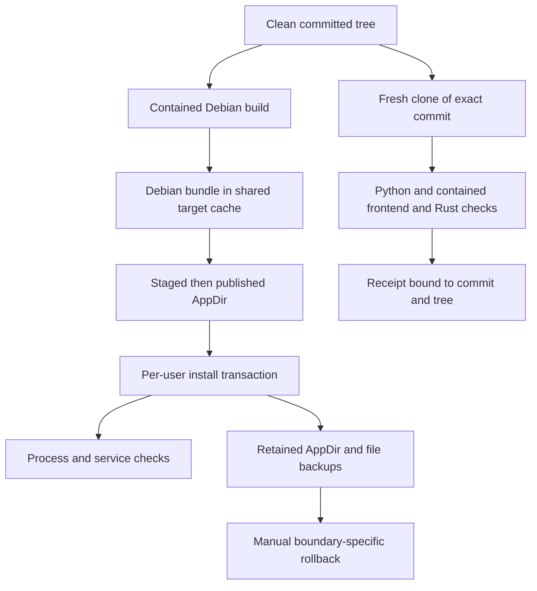

# Build, install, rollback, and Check

This is the release-critical path for the private Linux/X11 product. Runtime ownership and remote delivery are documented in [System architecture](../architecture/overview.md) and [Remote and target-safe delivery](../runtime/remote-and-delivery.md).



_The build publishes an installable AppDir; Check independently proves an exact Git tree; rollback is manual._

## Build and package contract

Run from a clean checkout as the normal operator:

```bash
QQ_BUILD_MEM=8g ops/build/build-local.sh
```

`build-local.sh` refuses staged, unstaged, or untracked files. It creates or reuses `${XDG_CACHE_HOME:-$HOME/.cache}/qq-dictation/build/{cargo,target,ort}`, rejecting a non-absolute or control-character-bearing cache base and a symlink at the canonical cache root. `node_modules/` remains checkout-local; `.local-build/` is the only checkout-local output.

The script builds `qq-dictation-builder:ubuntu24.04` from `ops/build/Dockerfile`, then runs it as the operator UID/GID with:

- Ubuntu 24.04, Rust `1.96.0`, Bun `1.3.3`, and lock-selected JS/Rust dependencies;
- 8 GiB memory and 8 GiB memory-swap, two CPUs, one Cargo job, one CMake job, and `NODE_OPTIONS=--max-old-space-size=4096`;
- the checkout mounted at `/work` and the shared cache at `/qq-build-cache`;
- `bun install --frozen-lockfile`, then `bun run tauri build --bundles deb` only.

`QQ_BUILD_MEM` may lower both memory limits. Do not raise the proven boundary or run an unconstrained host build without new evidence: earlier native/Vulkan and frontend builds exhausted smaller or unconstrained limits. Do not run the whole script with `sudo`; if Docker requires elevation, narrowly elevate Docker only.

### Packaging and artifacts

Tauri builds only the Linux Debian target. The package declares host dependencies `libgtk-layer-shell0` and `libopenblas0`, installs private speech libraries under `/usr/lib/Handy`, and includes `resources/**/*`.

| Artifact                                               | Contract                                                                                      |
| ------------------------------------------------------ | --------------------------------------------------------------------------------------------- |
| `${cache}/target/release/bundle/deb/Handy_*_amd64.deb` | Intermediate Debian bundle in persistent shared target state.                                 |
| `.local-build/Handy.AppDir/`                           | Debian payload extracted through a sibling staging directory, then renamed into place.        |
| `.local-build/Handy.AppDir/AppRun`                     | Adds `usr/lib/Handy` and `usr/lib` to `LD_LIBRARY_PATH`, then execs `usr/bin/handy`.          |
| `.local-build/Handy.AppDir/qq-dictation-commit`        | Text marker written from `git rev-parse HEAD`.                                                |
| `ops/package/handy`                                    | Installed launcher; selects Vulkan PCI device `1002:1900`, then execs the installed `AppRun`. |

A successful script exit means a Debian file was found and an AppDir was published. Release acceptance additionally requires the final AppDir and executable to exist, the marker to equal the intended source commit, files to be operator-owned, and no new host/cgroup OOM evidence.

Inspect—but never prune—the expensive shared cache with:

```bash
ops/build/build-cache.sh inspect
```

It emits stable ownership, mode, size/count, last-write and rebuild-cost facts, and always reports `quiescence=not_proven` and `prune_authorized=false`. Migration/pruning requires separate authorization, fresh proof that no process, mount, or open file uses the tree, atomic rename to a sibling staging/quarantine path, verification, and a retained rollback window. Never merge old and new cache trees.

## Per-user installation

After verifying the intended AppDir:

```bash
ops/install/install-local.sh
```

Prerequisites include `/usr/bin/python3`, a working systemd user manager, X11, GTK layer-shell runtime, and `xdotool`. The sequence is exact and not globally atomic:

1. Require executable `.local-build/Handy.AppDir/AppRun` and install/update `~/.local/bin/handy-remote-stream.py` through the workstation installer.
2. Copy the AppDir to sibling staging. Stop and disable retired `handy-ptt.service`, stop `handy.service`, kill only this user's `handy` processes, wait up to five seconds for exit, and remove the stale readiness marker.
3. Rename an existing install to `~/.local/opt/qq-dictation/Handy.AppDir.backup.<UTC>.<pid>`; rename staging to `Handy.AppDir`.
4. Preserve first-seen `.before-qq-dictation` copies of the launcher and direct unit; install `handy` and `handy.service`. Remove only the active legacy bridge script and `handy-ptt.service`; keep their backup artifacts.
5. Back up existing settings as `settings_store.json.before-qq-dictation.<UTC>`, or create an empty private store. Atomically rewrite four policy keys: `overlay_style=minimal`, `herdr_binding_enabled=true`, `push_to_talk=true`, `auto_submit=true`; preserve unrelated JSON.
6. Reload systemd, enable and start `handy.service`, then require exactly one user-owned `handy` whose `/proc/<pid>/exe` is the installed binary and whose runtime readiness marker contains that PID plus `ready`, `prepared`, or `armed`.

App data under `${XDG_DATA_HOME:-$HOME/.local/share}/com.pais.handy`—models, history, recordings and logs—is not replaced. See [History and settings](../domains/history-settings.md) for persisted ownership.

`handy.service` runs `%h/.local/bin/handy --start-hidden` directly with `DISPLAY=:0`, restart-on-failure and one-second delay. It owns app lifecycle and readiness. qq/Herdr owns semantic workstation q-mode controls; this installer installs no key-grab bridge. The separate laptop remote client still owns its configured Left-Control/Space/Delete controls.

### Remote installers

```bash
/usr/bin/python3 ops/install/install-remote-workstation.py
/usr/bin/python3 ops/install/install-remote-laptop.py \
  --ssh-host WORKSTATION --delivery-mode local \
  --xdotool-path /usr/bin/xdotool
```

The workstation installer atomically installs only the SSH stream helper, refuses unsafe/non-owned destinations, and retains timestamped backups when content changes. The laptop installer validates a strict mode-`0600` config before replacing its client/unit; an existing config is preserved unless supplied arguments equal it exactly. It reloads, enables and restarts `handy-remote-client.service`, then samples `ActiveState`, `SubState`, `MainPID`, and `NRestarts` twice 1.1 seconds apart. Success requires `active/running`, positive unchanged PID, and unchanged restart count; failures include a bounded service diagnostic. Detailed mode requirements are in [Remote and target-safe delivery](../runtime/remote-and-delivery.md).

## Rollback contract

There is no automatic rollback and no cross-boundary merge.

- **Build failure:** installed product is untouched; remove no shared cache merely because the build failed.
- **AppDir:** stop the service/application, move the failed AppDir aside, rename exactly one known `Handy.AppDir.backup.<UTC>` back to `Handy.AppDir`, then restart.
- **Launcher or direct unit:** restore the corresponding `.before-qq-dictation` file. After restoring a unit, run `systemctl --user daemon-reload` and restart that service. Legacy bridge/unit backups are migration evidence, not active files to reinstall unless intentionally rolling back the whole control model.
- **Settings:** restore one timestamped `settings_store.json.before-qq-dictation.<UTC>` as a whole file; do not merge guessed fields.
- **Remote files:** restore the installer-produced `.before-qq-dictation.<UTC>.<pid>` regular-file backup; explicitly reload/restart and recheck service state.
- **Cache:** use only the separately authorized staging/quarantine reversal. Never treat product rollback as cache rollback.

Because installation performs several effects before its final health gate, any nonzero exit requires inspection of which boundaries changed before restoration.

## Exact-commit Repository Check

Commit first, then run:

```bash
tools/check.sh "$(git rev-parse HEAD)"
```

The optional argument defaults to `HEAD` but must resolve unambiguously to one lowercase 40-hex commit. Check requires exact host Node `v22.22.3`, Pi coding agent `0.84.1`, the prebuilt builder image, Docker, the canonical shared cache, and Python dependencies. It allocates private mode-`0700` state at `${XDG_STATE_HOME:-$HOME/.local/state}/qq-dictation/checks/run.*`, with a mode-`0600` `check.log`.

It records the source commit/tree/origin, clones locally with `--no-hardlinks`, detaches at the commit, verifies commit and tree, and runs:

```bash
env -i HOME="$PRIVATE_HOME" PATH=/usr/bin:/bin LANG=C.UTF-8 \
  PYTHONDONTWRITEBYTECODE=1 \
  /usr/bin/python3 -W error -m unittest discover -s tests -p 'test_*.py'
```

The same contained resource limits then run frozen Bun install, ESLint, repository-wide Prettier plus rustfmt, TypeScript and both Vite entries, and all Cargo tests. Finally Check re-verifies commit/tree, `git diff --check`, and an empty status. Subject clone and temporary HOME are removed; the private log remains.

Success prints exactly one line shaped as:

```text
qq-check-receipt/v1 commit=<40-hex> tree=<40-hex> timestamp=<UTC> node=v22.22.3 pi=0.84.1 log=<private-absolute-path>
```

Before cloning, Check resolves Docker, runs `docker image inspect --format '{{.Id}}' qq-dictation-builder:ubuntu24.04`, requires an identity shaped `sha256:` plus 64 lowercase hex digits, and records it in the private log. This proves which existing tagged image ran, not that its layers came from the current Dockerfile or an immutable external digest.

The receipt proves only that exact commit/tree passed this local procedure with the recorded versions and logged builder image ID. It is neither signed nor independently registered; the marker and receipt are evidence to verify, not trust anchors.

## GitHub workflows

| Workflow              | Triggers and path scope                                                                                                                                                                                     | Checks                                                                                                                                                          | Permissions, concurrency, pins                                                                                                                                                                                                                                                     |
| --------------------- | ----------------------------------------------------------------------------------------------------------------------------------------------------------------------------------------------------------- | --------------------------------------------------------------------------------------------------------------------------------------------------------------- | ---------------------------------------------------------------------------------------------------------------------------------------------------------------------------------------------------------------------------------------------------------------------------------- |
| `test.yml`            | Manual; push to `main`; PR. Automatic runs include only `src-tauri/**`, `ops/**`, `tests/**`, `tools/check.sh`, and itself. It omits frontend/config/docs paths and `experiments/**`.                       | Ubuntu 24.04 dependencies, root Python suite, then all Rust tests. No frontend lint/build/format.                                                               | No explicit `permissions`; per-PR-number or ref concurrency cancels in progress. `actions/checkout@v5` and `swatinem/rust-cache@v2` are movable major tags, not commit pins.                                                                                                       |
| `code-quality.yml`    | Manual; push to `main`; PR. Includes frontend/backend/ops/tests/docs, root manifests/config, README, and all workflow files; omits `experiments/**` and `openwiki/**` unless another included path changes. | Bun `1.3.3`, frozen install, ESLint, Prettier and rustfmt. It does **not** run TypeScript/Vite build, Python, or Cargo tests.                                   | No explicit `permissions`; same canceling per-PR/ref concurrency. `checkout@v5` and `setup-bun@v2` are tag pins.                                                                                                                                                                   |
| `openwiki-update.yml` | Manual and daily at `08:00 UTC`; no path filter.                                                                                                                                                            | Full-history checkout, Node 22, global exact OpenWiki/Mermaid/jsdom versions, `openwiki code --update --print`, then a documentation PR from `openwiki/update`. | Explicit `contents: write` and `pull-requests: write`; no concurrency stanza. Checkout, setup-node, and create-pull-request use immutable commit SHAs with version comments. Provider and optional LangSmith access cross the external-secret boundary through repository secrets. |

The OpenWiki PR may add `openwiki`, `AGENTS.md`, `CLAUDE.md`, and its own workflow. Full history is required so update mode can diff against the previously documented commit. The two ordinary CI workflows use no repository secrets in source and split tests from style; neither equals the fuller exact-commit Check. `test.yml` installs `libwebkit2gtk-4.1-dev`, `libappindicator3-dev`, `librsvg2-dev`, `libasound2-dev`, `libssl-dev`, `libgtk-layer-shell-dev`, `libvulkan-dev`, `glslc`, `spirv-headers`, and `python3-xlib`, then uses `swatinem/rust-cache@v2` for `./src-tauri -> target`; it does not install Bun. `code-quality.yml` installs no apt packages or Rust cache, but installs Bun 1.3.3 with `oven-sh/setup-bun@v2` and frozen JS dependencies.

## Reproducibility limits and hazards

- Rust one-hop provenance includes Git-sourced `rdev` (shortcuts), `vad-rs` (VAD), `rodio` (feedback), the `hf-hub` `cancellable-downloads` branch, and an explicit `tao` revision patch for Linux Wayland decorations. `Cargo.lock` fixes resolved commits for this tree, but manifest branch/tag references remain upgrade and supply-chain review seams. Changes require the affected shortcut/VAD/audio/model/window tests and exact-commit Check.
- `src-tauri/build.rs` discovers transcribe-cpp runtime/backend directories, selects one dereferenced `.so` per library stem, stages them into `transcribe-libs` for private `/usr/lib/Handy`, adds `$ORIGIN/../lib/Handy` rpath, and fails packaging when dynamic-backend directories yield no libraries.
- Ubuntu is named by release, but apt repositories, downloaded Rust/Bun installers, semver-ranged JS dependencies, Cargo registries, base-image digest, host Docker/kernel/hardware, and caches are not a fully hermetic supply chain. `bun.lock`, `Cargo.lock`, and tool versions narrow—not eliminate—variation.
- The build locates the first matching Debian file in persistent target output. A stale matching `.deb` can be selected if the expected new package is absent or ordering differs; clear nothing without authorization, and verify package/marker provenance.
- The builder writes a commit marker, but the installer checks only executable `AppRun`; it does not compare the marker with source HEAD. Verify it manually before installation.
- Settings are rewritten with `os.replace`; the replacement file's mode follows creation policy rather than explicitly preserving the old file mode. Inspect and correct privacy after install.
- Install is a partial transaction: remote helper, AppDir, files, settings and services can be at different generations after failure. Backups enable manual recovery but do not prove recovery occurred.
- CI path omissions can leave frontend changes without `test.yml`, experiment changes without either ordinary workflow, and OpenWiki-only changes without code quality. Run the relevant narrow suite explicitly.
- GitHub actions in ordinary CI are major-tag pins; the OpenWiki workflow is SHA-pinned, but its `npm install --global` still performs network resolution.
- Unit/static checks do not establish X11 grabs, microphones, GPU/Vulkan/ORT selection, WebKit/GTK behavior, systemd user sessions, SSH, package runtime closure, or absence of host OOM events.

## Narrow validation commands

```bash
# Root Python operational tests
PYTHONDONTWRITEBYTECODE=1 /usr/bin/python3 -W error \
  -m unittest discover -s tests -p 'test_*.py'

# Benchmark tooling tests, omitted by ordinary CI
PYTHONDONTWRITEBYTECODE=1 /usr/bin/python3 -W error \
  -m unittest discover -s experiments/task30_rx6400 -p 'test_*.py'

# CI-equivalent style and compilation slices
bun install --frozen-lockfile
bun run lint && bun run format:check && bun run build
cargo test --manifest-path src-tauri/Cargo.toml
```

Run `tools/check.sh` only for a committed target. A package build or install is an explicit operator action, not a source-only validation step.
