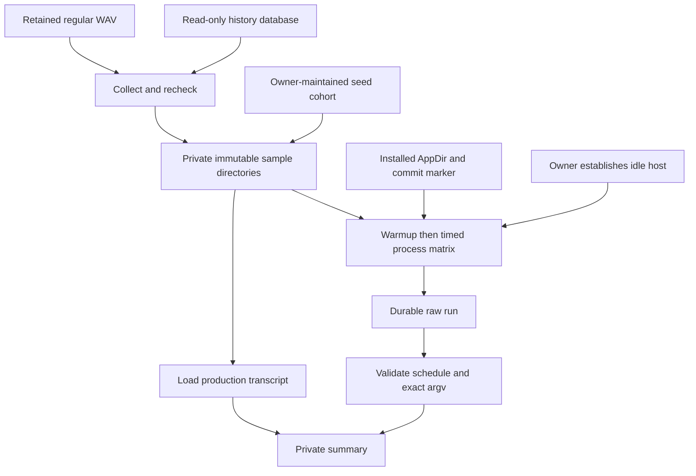

# Private RX 6400 benchmark

`experiments/task30_rx6400` measures an explicitly installed qq-dictation AppDir against private natural dictation. It does not alter product source, settings, retention, models, or history. Build and provenance requirements are in [Build, install, rollback, and Check](build-install-check.md); model/backend meaning is in [Models and acceleration](../domains/models.md).



_Collection publishes stable samples; execution preserves every observation; summarization validates before comparison._

## Private-data boundary

The corpus, configuration, raw stdout/stderr, transcripts, results, review sheets, watcher output and reports are private. Keep every real path outside the worktree under a private parent, use `umask 077`, and never commit or paste them into issues or fixtures. Tests use invented temporary data only.

The tooling requires absolute paths and rejects symlinked corpus/app/output objects where plain files or directories are required. It enforces mode `0700` on created corpus/sample/result/report directories and `0600` on created files. This is a local permission boundary, not encryption or a backup policy.

`seed-existing.json` is owner-maintained and never rewritten. It may be an ID array or contain exactly one of `history_ids`, `sample_ids`, or `ids`; IDs are canonical positive history IDs. Those IDs form `existing-saved`; all other published samples are `fresh`.

## 1. Collect

One-shot collection is idempotent; watch mode polls until Ctrl-C:

```bash
umask 077
python3 experiments/task30_rx6400/collect_corpus.py \
  --database '/private/live/history.db' \
  --recordings '/private/live/recordings' \
  --corpus '/private/task30/corpus' \
  --watch --interval 1
```

The collector opens SQLite with `mode=ro` and `PRAGMA query_only=ON`, selecting completed nonempty rows with `audio_available=1`. For each safe `.wav` basename it stages:

```text
corpus/samples/<history-id>/audio.wav
corpus/samples/<history-id>/metadata.json
```

Metadata contains `raw_transcript`, nullable `post_processed_transcript`, and `production_transcript`; production text is post-processed text when non-null, otherwise raw text.

Publication is deliberately strict:

1. Open the source WAV without following symlinks, require a regular file, copy and fsync it, and compare device/inode/mode/size/mtime/ctime before and after.
2. Write and fsync metadata.
3. Re-read the history row and source metadata.
4. Rename the complete staging directory to the final sample ID and fsync the samples directory.

An existing sample must contain exactly `audio.wav` and `metadata.json`; metadata must equal live history, and SHA-256 of corpus/live WAV must match. Changed sources, unsafe names, or conflicting prior output fail rather than overwrite or publish a partial sample. Poll status reports counts only, not transcript text. Stop the watcher before moving or retiring its corpus.

## 2. Configure and establish idle state

The private JSON config names:

- `installed_appdir` and executable inside it, both outside the worktree;
- `corpus` and a **new**, nonexistent `output_dir`;
- cohort `existing-saved` or `full`;
- at least one warmup round, at least five timed rounds, positive finite timeout;
- a nonempty ordered arm list of unique name, exact installed model ID, and nonnegative device index.

The runner never downloads a model. It requires an installed `.AppDir`, an owner-executable contained executable, and a `qq-dictation-commit` containing exactly 40 lowercase hex characters. The marker records provenance but is not cryptographically verified.

Immediately before each run, the accountable owner must freshly establish an idle host: no build, Docker/container workload, or competing GPU/CPU activity. Run promptly after that decision. The runner records `/proc/loadavg`, uptime, CPU count, cgroup/mount-namespace facts, process scans for build/container markers, installed paths/commit, and exact `<executable> --list-devices` output. These observations support, but cannot replace, owner adjudication; daemons, unreadable processes and unrecognized workloads can escape the scan.

A minimal config shape is:

```json
{
  "installed_appdir": "/private/installed/Handy.AppDir",
  "executable": "/private/installed/Handy.AppDir/AppRun",
  "corpus": "/private/task30/corpus",
  "output_dir": "/private/task30/results/phase1-raw",
  "cohort": "existing-saved",
  "warmup_rounds": 1,
  "timed_rounds": 5,
  "timeout_seconds": 600,
  "arms": [
    {
      "name": "rx6400-device-0",
      "model": "handy-computer/parakeet-unified-en-0.6b-gguf/parakeet-unified-en-0.6b-Q8_0.gguf",
      "device_index": 0
    }
  ]
}
```

Use `existing-saved` for the initial same-model device comparison; use a new output and `full` for candidate models. Preserve arm order across comparable runs.

## 3. Run

```bash
umask 077
python3 experiments/task30_rx6400/run_benchmark.py \
  '/private/task30/phase1.json'
```

For every selected sample, the schedule is all warmup rounds followed by all timed rounds; within each round, arms run in config order. Every observation starts a separate process with exactly:

```text
<executable> --transcribe-file <corpus>/samples/<id>/audio.wav --model <exact-model-id> --device-index <exact-index> --repeat 1 --json
```

There is no shell invocation. Successful JSON must report the exact model, `requested_device` as `index N`, optional string backend, positive audio/transcription time, nonnegative load/RTF, one transcription timing equal to `best_ms`, and text.

### Durability and completion

- `output_dir` must not exist; the runner never resumes or overwrites a run.
- `run.json` is written after machine/device discovery and before the matrix.
- Every observation records sequence, phase/round/arm/sample, exact argv, UTC bounds, elapsed time, exit status, parsed JSON or parse error, complete stdout/stderr, and failure mode.
- Each `observations.jsonl` record is appended and `fsync`ed before proceeding.
- Timeout, launch, nonzero-exit, malformed output, and model/device/schema failures remain in schedule; later observations still run.
- `completion.json` is written durably after the matrix with `complete` or `complete_with_failures`; process exit is nonzero when any observation failed. Device enumeration failure writes `failed_device_list` with zero observations and exits nonzero.
- Abrupt interruption can leave a valid prefix without `completion.json`; do not treat it as complete or append to it. Start a new output directory.

## 4. Summarize

```bash
python3 experiments/task30_rx6400/summarize_results.py \
  '/private/task30/results/phase1-raw' \
  --output '/private/task30/results/phase1-report'
```

The report directory must be new. The summarizer loads `run.json` and all JSONL records, reconstructs the full sample → phase → round → listed-arm schedule, and checks count, sequence, identity, exact argv, installed commit, machine-state fields and successful result schemas. Validation problems are listed in the report and make summarization exit nonzero; failures honestly recorded by the runner are reported as failures and do not themselves invalidate the schedule.

## Artifacts

| Location                            | Contents and use                                                                              |
| ----------------------------------- | --------------------------------------------------------------------------------------------- |
| `corpus/seed-existing.json`         | Owner-owned cohort boundary; collector reads but never extends it.                            |
| `corpus/samples/<id>/audio.wav`     | Stable private source copy.                                                                   |
| `corpus/samples/<id>/metadata.json` | Raw, post-processed and selected production transcript.                                       |
| `<raw>/run.json`                    | Config snapshot, selected samples/arms, installed marker, machine/device/idle evidence.       |
| `<raw>/observations.jsonl`          | Fsynced complete observation stream, including failures and private text/logs.                |
| `<raw>/completion.json`             | Terminal status and observation/failure counts.                                               |
| `<report>/summary.md`               | Raw-run validity, failures, timed performance, streaming-log observations and nondeterminism. |
| `<report>/differential-review.csv`  | Production and every distinct timed candidate variant, with blank owner-adjudication columns. |

All are private and mode `0600`; containing directories are mode `0700`.

## Interpretation

Only successful **timed** observations feed performance statistics; warmups are excluded. For each arm and arm/file pair, the summary reports best and median real-time multiple (`audio seconds / transcription seconds`) and best/median cold `load_ms`. A larger real-time multiple is faster. Because every invocation is a new process, `load_ms` reflects cold process/model loading rather than steady in-process reuse.

Treat results narrowly:

- `supports_streaming` is parsed from observed stderr load logs; absence means “not observed,” and conflicting values are marked nondeterministic. It is not an independent capability probe.
- Multiple text variants for one arm/file are retained and counted; none is silently selected.
- `differential-review.csv` compares production text with each distinct timed candidate and leaves `materiality`, `preference`, and `notes` blank for owner review.
- Production transcript is not ground truth. This is not WER, semantic accuracy, broad corpus quality, thermal stability, energy use, interactive latency, or proof for other hardware/drivers/models.
- Device indices are installation/host observations, not stable hardware identities. Confirm `--list-devices` and backend logs for each run.
- Commit marker, process scan and idle evidence support provenance and comparability but do not guarantee an untampered binary or perfectly quiescent machine.

## Focused tests

```bash
PYTHONDONTWRITEBYTECODE=1 /usr/bin/python3 -W error \
  -m unittest discover -s experiments/task30_rx6400 -p 'test_*.py'
```

The synthetic suite covers idempotent collection, cohort preservation, transcript selection, permissions, changed/conflicting source refusal with no partial publication, malformed numeric/ID inputs, exact arm interleaving and argv, warmup exclusion, aggregation, variant review rows, machine/provenance capture, and durable failed-arm completion. It does not exercise a live database, private corpus, installed model, RX 6400, Vulkan driver, thermal state, or owner review.
