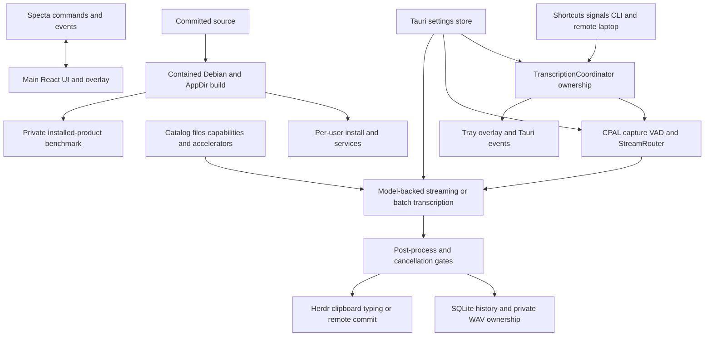

# Handy engineering quickstart

Handy is a Linux/X11-oriented Tauri dictation product: Rust owns process authority, audio, inference, persistence, and native effects; two React/Vite entries provide settings/onboarding and the recording overlay; Python helpers provide local PTT and remote-laptop transport. Start with the canonical page for the boundary being changed, then inspect its named source and focused tests.

## Product and system map



*The coordinator is the operation authority; managers own resources, persistence, and effects, while build and benchmark flows remain operator-controlled.*

## Canonical documentation

| Page | Use it for major concepts and APIs |
|---|---|
| [System architecture and ownership](architecture/overview.md) | [desktop versus headless composition](architecture/overview.md#runtime-shape), [manager ownership](architecture/overview.md#composition-and-ownership), [native shell lifecycle](architecture/overview.md#native-shell-lifecycle), startup/shutdown, frontend boot, and system invariants. |
| [Dictation pipeline lifecycle](runtime/dictation-pipeline.md) | [`TranscriptionCoordinator`, `Stage`, and `OperationOwner`](runtime/dictation-pipeline.md#responsibility-and-entrypoints), [input timing and dictation mode](runtime/dictation-pipeline.md#input-timing-and-dictation-mode), [capture/VAD](runtime/dictation-pipeline.md#capture-vad-and-microphone-lifetime), [stop-to-delivery ordering](runtime/dictation-pipeline.md#stop-to-delivery-ordering), streaming fallback, cancellation, and overlay behavior. |
| [Remote dictation and target-safe delivery](runtime/remote-and-delivery.md) | [`RemoteIngress` and delivery entrypoints](runtime/remote-and-delivery.md#ownership-and-entrypoints), [framed protocol v1](runtime/remote-and-delivery.md#protocol-v1), PTT clients, [local/remote Herdr and laptop injection](runtime/remote-and-delivery.md#target-semantics-and-delivery), socket security, and fail-closed one-shot effects. |
| [Models, capabilities, language, and acceleration](domains/models.md) | [`EngineType`, `ModelSource`, `ModelInfo`, and accelerator APIs](domains/models.md#public-types), registry/discovery, downloads, [selection/loading/unloading](domains/models.md#selection-loading-and-unloading-invariants), language/translation, onboarding, and model events. |
| [History durability and settings ownership](domains/history-settings.md) | [SQLite/WAV lifecycle](domains/history-settings.md#history-schema-and-lifecycle), retention, [history API/UI](domains/history-settings.md#history-api-and-ui), [`AppSettings` defaults and migration](domains/history-settings.md#appsettings-store-defaults-and-migration), optimistic frontend ownership, and extension recipes. |
| [React application, IPC API, CLI, events, and native shell](frontend/app-and-api.md) | [frontend composition](frontend/app-and-api.md#application-boot-and-composition), [generated Specta binding seam](frontend/app-and-api.md#ipc-contract-and-generated-binding-seam), [complete command surface](frontend/app-and-api.md#complete-command-surface), [events](frontend/app-and-api.md#events), [CLI](frontend/app-and-api.md#cli), tray/windows/autostart, feedback, and logging privacy. |
| [Build, install, rollback, and Check](operations/build-install-check.md) | [contained build/package](operations/build-install-check.md#build-and-package-contract), [per-user install](operations/build-install-check.md#per-user-installation), rollback, [exact-commit Check](operations/build-install-check.md#exact-commit-repository-check), CI workflows, caches, provenance, and release hazards. |
| [Private RX 6400 benchmark](operations/rx6400-benchmark.md) | Private-data boundary and the [collect](operations/rx6400-benchmark.md#1-collect) → [configure](operations/rx6400-benchmark.md#2-configure-and-establish-idle-state) → [run](operations/rx6400-benchmark.md#3-run) → [summarize](operations/rx6400-benchmark.md#4-summarize) workflow, artifacts, interpretation, and synthetic tests. |

Core source entrypoints are `src-tauri/src/main.rs::main`, `src-tauri/src/lib.rs::run` and `initialize_core_logic`, `src/main.tsx`, `src/App.tsx`, and `src/overlay/main.tsx`. The generated frontend IPC contract is `src/bindings.ts`; command/event registration in `lib.rs` is authoritative and the generated file must not be hand-edited.

## Invariants to preserve

- `TranscriptionCoordinator` is the sole local/remote operation authority; every non-idle transition and effect is matched to the exact `OperationOwner`.
- Native transcription backend/accelerator initialization precedes model loading; only one engine/load claim and one stream lease may be authoritative at a time.
- Accepted audio frames and stream finalization share FIFO ordering; blank/unsupported streaming may use batch fallback, but finalization error/timeout does not race a leased engine.
- Cancellation is checked through processing and immediately before delivery. Local delivery occurs once; remote ready output is hidden until a consuming one-shot commit and is never retried after an uncertain effect.
- History owns a WAV only after exclusive private-file reservation, successful write/verification, and database handoff. `audio_available` is filesystem-derived truth; audio and text retention are independent.
- Rust defaults and the complete persisted `AppSettings` object are authoritative. Writers use read-modify-write; frontend optimistic state is not proof of persistence or native side effects.
- Runtime-loaded capabilities supersede catalog/probe hints. Selected language remains user intent and is resolved against the loaded model for each use.
- Overlay listeners are installed before readiness is marked. Hidden startup must retain a tray route; close hides rather than exits.
- Headless stdout is result-only, with logs on stderr; success/runtime/input exit codes are `0`/`1`/`2`.
- App data, recordings, transcripts, logs, benchmark corpora, and results are private. Build/install/benchmark are explicit operator actions, not ordinary source validation.

## Common commands

Run from the repository root unless shown otherwise:

```bash
# Frontend static integration
bun install --frozen-lockfile
bun run lint
bun run build
bun run format:check

# Backend and operational tests
cargo test --manifest-path src-tauri/Cargo.toml
PYTHONDONTWRITEBYTECODE=1 /usr/bin/python3 -W error \
  -m unittest discover -s tests -p 'test_*.py'
PYTHONDONTWRITEBYTECODE=1 /usr/bin/python3 -W error \
  -m unittest discover -s experiments/task30_rx6400 -p 'test_*.py'

# Local development
bun run tauri dev

# Clean-tree package build and cache inspection
QQ_BUILD_MEM=8g ops/build/build-local.sh
ops/build/build-cache.sh inspect

# Exact committed-tree validation
tools/check.sh "$(git rev-parse HEAD)"
```

Install only after validating the intended `.local-build/Handy.AppDir` and commit marker: `ops/install/install-local.sh`. Headless operator examples are `handy --list-devices`, `handy --list-models --json`, and `handy --transcribe-file INPUT.wav --model ID --device-index N --repeat 1 --json`; input WAV must be 16 kHz mono signed 16-bit PCM.

## Task routing

| Change intent | Canonical page | Owning source entrypoints or symbols | Focused tests | Minimal validation |
|---|---|---|---|---|
| Startup, managed state, windows, shutdown, or headless mode | [Architecture](architecture/overview.md) | `main.rs::main`; `lib.rs::{run,initialize_core_logic,run_headless_guarded}`; `cli.rs::CliArgs`; `overlay::create_recording_overlay` | `headless_guard_tests`; `transcription_coordinator::tests` | Focused Cargo filter + `bun run build` |
| Trigger, ownership, audio, VAD, stream/batch, cancellation, or overlay lifecycle | [Dictation pipeline](runtime/dictation-pipeline.md) | `TranscriptionCoordinator`; `OperationOwner`; `actions::{TranscribeAction,finish_operation}`; `AudioRecordingManager`; `TranscriptionManager`; `StreamRouter`; `signal_handle`; `overlay` | `transcription_coordinator::tests`; `managers::{audio,transcription}::tests`; `actions::tests`; `signal_handle::tests`; `overlay::tests` | Run changed module filters; use representative Linux hardware only for affected native effect |
| Remote protocol, socket, PTT, Herdr, clipboard, typing, or injection | [Remote and delivery](runtime/remote-and-delivery.md) | `remote::RemoteIngress`; coordinator `remote_*`; `target_binding`; `clipboard::paste`; `input`; `ops/install/handy-{remote-*,ptt-bridge}.py` | `remote::tests`; `target_binding::tests`; `clipboard::tests`; `tests.test_{remote_helpers,remote_laptop_client,handy_ptt_bridge}` | Rust boundary + matching Python suite; live SSH/X11/Herdr only when behavior changes |
| Model catalog, source, download, capability, engine, language, or accelerator | [Models](domains/models.md) | `ModelManager`; `TranscriptionManager`; `EngineType`; `ModelSource`; `LoadedEngine`; `GgufHeaderProber`; `commands::models`; `ops/build/gen_catalog.py` | `catalog::tests`; `managers::{gguf_meta,model_capabilities,model,transcription}::tests`; `commands::models::tests` | Focused Cargo filters + `bun run build`; hardware test for accelerator claims |
| History schema, WAV safety, retention, retry, or history UI | [History and settings](domains/history-settings.md) | `managers::history::{HistoryManager,PendingAudioGuard,HistoryEntry}`; history commands; `actions`; History page | `managers::history::tests` | History filter + `bun run build` when IPC/UI changes |
| Setting/default/migration, shortcut setting, or runtime side effect | [History and settings](domains/history-settings.md) | `settings::{AppSettings,get_settings,write_settings,get_default_settings}`; setting/shortcut commands; `src/stores/settingsStore.ts` | `settings::tests`; `tests.test_install_local_settings` | Both focused suites + `bun run lint && bun run build` |
| React page/store/onboarding, command/event, capability, tray, feedback, or logging | [Frontend and IPC](frontend/app-and-api.md) | `src/{main.tsx,App.tsx,bindings.ts}`; `src/overlay/main.tsx`; `lib.rs` `collect_commands!`/`collect_events!`; capabilities; `tray`; `audio_feedback` | `tray::tests` plus owning backend domain tests | `bun run lint && bun run build && bun run format:check`; regenerate bindings through debug Rust build |
| Build, package, dependency, installer, service, rollback, CI, or Check | [Build/install/Check](operations/build-install-check.md) | `ops/build/*`; `src-tauri/{Cargo.toml,build.rs,tauri.conf.json}`; `ops/install/*`; `tools/check.sh`; `.github/workflows/*` | root Python suite; affected Cargo tests | Narrow tests first; contained build for packaging; `tools/check.sh` only on committed target |
| RX 6400 corpus, runner, report, or interpretation | [Benchmark](operations/rx6400-benchmark.md) | `experiments/task30_rx6400/{collect_corpus,run_benchmark,summarize_results}.py` | experiment `test_*.py` | Synthetic suite; private installed-product run only for an actual benchmark |

## Source-of-truth cautions

Source plus tests outrank prose when they disagree. In particular, the current PTT key is `Control_L`; registered commands/events—not a remembered count—define IPC; `src/bindings.ts` is generated; catalog capabilities are advisory until load; successful autostart/settings optimism does not prove the native effect; a build marker or Check receipt records evidence but is not a trust anchor. Ordinary CI is split and has path omissions, so select validation from the table rather than assuming one workflow covers the change.

## Backlog: evidence-blocked live integration

These are the only deferred areas; their components and static contracts are documented above.

- **Linux desktop/audio effects:** prove changed microphone permission/latency, CPAL device behavior, mute restoration, live VAD quality, overlay/tray/window-manager behavior, feedback playback, clipboard/typing, and webview-log privacy on representative sessions. Anchors: `managers/audio`, `audio_toolkit`, `overlay.rs`, `tray.rs`, `audio_feedback.rs`, `clipboard.rs`, `input.rs`. Reason: unit/static tests cannot exercise devices, compositors, portals, focus, or audio servers.
- **Remote target delivery:** prove changed SSH, PipeWire, X11 grabs/focus, systemd user services, Ghostty/Herdr identity, and target rendering end to end. Anchors: `remote.rs`, `target_binding.rs`, `ops/install/handy-remote-*.py`, `ops/install/handy-ptt-bridge.py`. Reason: repository tests use protocol/state-machine doubles and cannot establish a live external session or exactly-once recipient outcome.
- **Acceleration and installed runtime:** prove changed Vulkan/CUDA/ROCm/ORT device selection, VRAM/offload, package runtime closure, autostart, service health, and absence of host OOM on the intended host/model. Anchors: `managers/transcription`, model accelerator commands, `src-tauri/build.rs`, `ops/build/build-local.sh`, `ops/install/install-local.sh`. Reason: availability enumeration, contained tests, and synthetic benchmark tests do not establish driver execution or host integration.
