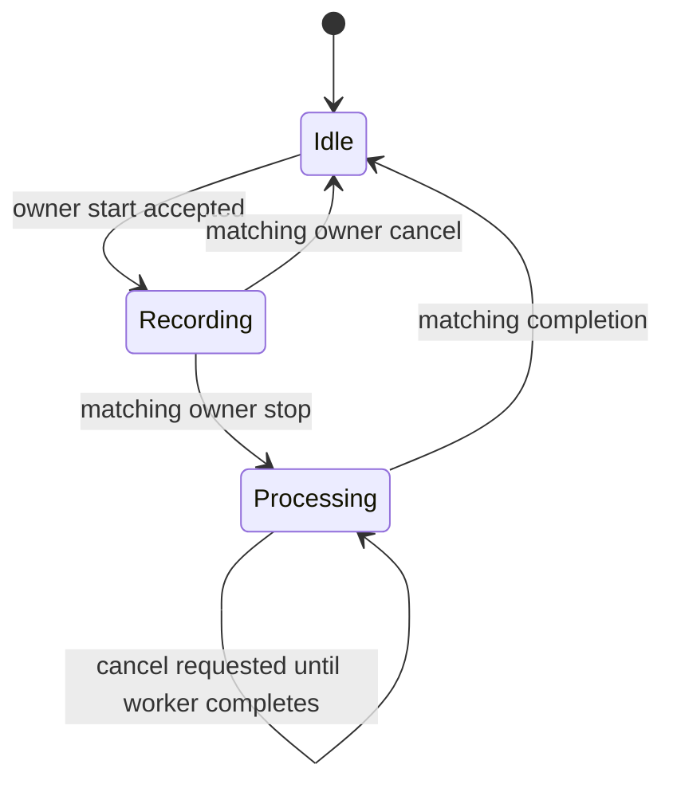
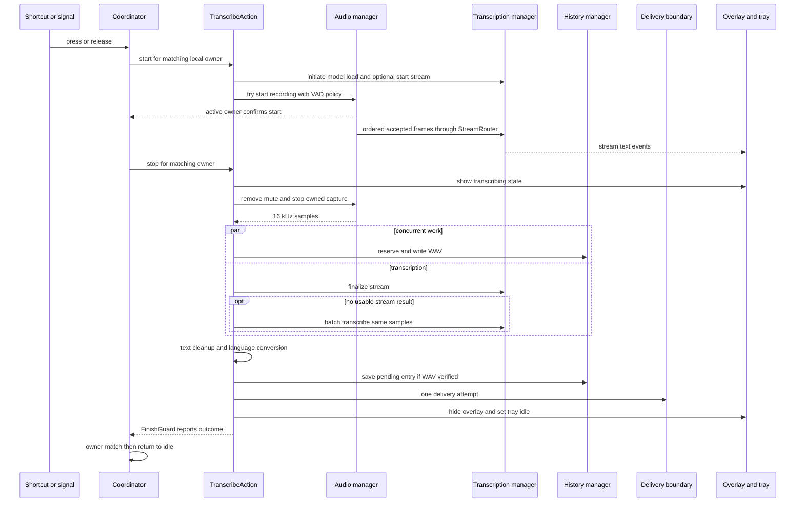

# Dictation pipeline lifecycle

## Responsibility and entrypoints

`transcription_coordinator.rs::TranscriptionCoordinator` is the serialization boundary for local shortcuts, Unix signals, CLI forwarding, dictation-mode commands, and remote requests. Its private worker owns `Stage`:



*Core `Stage` lifecycle; every non-idle stage carries the exact `OperationOwner`.*

`operation.rs::OperationOwner` is either `Local { binding_id }` or `Remote { request_id }`. The identity must match at stop, cancel, completion, audio feed, and remote commit boundaries. Local controls never stop or cancel a remote owner, and a busy or processing pipeline never turns an extra press into a deferred start.

Exact local entrypoints are:

- `shortcut::handler::handle_shortcut_event` → `TranscriptionCoordinator::send_input`.
- `signal_handle::send_transcription_input` for `SIGUSR1`, `SIGUSR2`, and realtime `SIGRTMIN`/`SIGRTMIN+1` PTT press/release.
- Forwarded `--toggle-transcription [--herdr-pane PANE_ID]` → `cli::running_instance_command` → `TranscriptionCoordinator::start_or_stop`.
- `TranscriptionCoordinator::{mode_prepare, mode_on, mode_off, mode_space, mode_delete}` for the dormant `SIGRTMIN+2` through `SIGRTMIN+6` compatibility seam.
- `commands::cancel_operation`, tray, or targetless CLI `--cancel` → `utils::cancel_current_operation` → `request_local_cancel`.

Remote methods use the same worker but add request and connection ownership; protocol details are in [Remote and delivery](remote-and-delivery.md).

## Input timing and local controls

All pressed `Command::Input` events share a **30 ms debounce**. PTT release for the currently recording binding is delayed by **50 ms**; a same-binding press during that grace cancels the pending release. This absorbs X11 autorepeat release and press bursts. A genuine release stops exactly once after the grace timeout.

The current workstation q mode is owned by qq/Herdr, which invokes semantic CLI controls against the already-running app. On `Idle`, `--toggle-transcription --herdr-pane PANE_ID` validates the public pane ID and starts with `StartTarget::ExplicitPane`; the no-pane form uses `StartTarget::Auto`. While the matching `transcribe` owner is recording, the same command stops and ignores the caller's current pane, preserving the start target. During processing or remote ownership it does nothing. `--cancel` is idempotent, targetless, and affects only local recording or processing.

The app still retains an independent `prepared` and `armed` realtime-signal protocol, reset off at every app start, as a dormant compatibility seam:

1. `ModePrepare` is accepted only while neither prepared nor armed, then publishes `prepared` readiness.
2. `ModeOn` requires prepared, sets armed, shows the armed overlay if idle, and publishes `armed`.
3. Armed `Space` starts local capture from idle or stops the matching local recording; it does nothing to remote or processing work.
4. Armed `Delete` cancels only locally owned recording or processing.
5. `ModeOff` clears both flags, publishes `ready`, and cancels locally owned work; it does not cancel remote ownership.

Realtime signal numbers remain deliberately ordered prepare, on, off, Space, Delete. `signal_handle::setup_signal_handler` registers the ordinary and realtime signals, its signal thread maps each number to `send_transcription_input` or the corresponding coordinator mode method, and all paths therefore enter the serialized `Command` channel. `overlay::clear_dictation_overlay_ready` runs before this registration, and the React overlay invokes `mark_dictation_overlay_ready` only after all listeners are installed. The current installer sends none of these mode signals; [installation](../operations/build-install-check.md#per-user-installation) starts the app directly with `handy.service`.

## Capture, VAD, and microphone lifetime

`actions.rs::TranscribeAction::start` starts model loading and VAD preload in parallel, sets tray and overlay state, chooses `VadPolicy`, then calls `AudioRecordingManager::try_start_recording`. `start_local` changes `Stage` to `Recording` only after `AudioRecordingManager::active_owner` confirms capture actually began; a microphone failure leaves the coordinator idle.

Policy is derived from settings and the selected model's advertised capability:

| Condition | `VadPolicy` | Live stream |
|---|---|---|
| VAD disabled | `Disabled` | only if model advertises streaming |
| VAD enabled and streaming model | `Streaming` | yes |
| VAD enabled and non-streaming or unknown model | `Offline` | no |

CPAL input is mixed to mono, resampled to 16 kHz, and framed at 30 ms by `FrameResampler`. `accept_16khz_frame` appends accepted speech and calls the `StreamRouter` callback in the same order. Silero VAD uses threshold `0.3`, 15 prefill frames, 2 onset frames, and hangover of 15 offline or 55 streaming frames. VAD errors fail open for that frame.

`AudioRecordingManager` separately enforces `RecordingState::{Idle, Recording, Stopping}` with the same owner. Stop moves to `Stopping` before optional local trailing-buffer capture, drains audio through an end-of-stream sentinel, finishes the resampler, and only then returns to idle. Recordings shorter than one second are padded to 1.25 seconds when non-empty.

Microphone modes differ only in resource and feedback ordering:

- **Always-on:** `AudioRecordingManager::new` opens the stream at startup. Start feedback plays, then mute is applied; capture can start immediately. Stop leaves the stream open.
- **On-demand:** capture opens first; after 100 ms, start feedback plays and mute is applied. Stop closes immediately unless `lazy_stream_close` schedules a 30-second generation-guarded close. A new start invalidates that close.

Mute handling snapshots the user's prior output state and restores it. A pre-muted system remains muted; unknown state defaults to unmuting so the application does not strand audio. Local capture owns feedback and mute; remote capture does not.

## Stop-to-delivery ordering



*Local stop path; WAV persistence runs concurrently with transcription, while delivery remains the final owner-sensitive effect.*

`actions.rs::finish_operation` first changes tray and overlay to working, restores local mute, captures `cancel_generation`, then spawns the async pipeline. Ordering invariants are:

1. `AudioRecordingManager::stop_owned` accepts only the matching owner.
2. Cancellation is checked after stop, before output handling, during async output processing at 25 ms intervals, and immediately before delivery.
3. WAV reservation and write run concurrently with transcription; history is saved only after WAV verification.
4. `TranscriptionManager::finalize_stream` is attempted first. A nonblank result wins. `Ok(None)` or blank output falls back to `transcribe(samples)`. A finalize error or 30-second timeout is surfaced, because the worker may still lease the engine and batch fallback could contend with it.
5. Custom-word correction and filler or stutter filtering are shared by streaming and batch paths; optional cleanup is panic-safe and falls back to raw text. `process_transcription_output` then applies Chinese script conversion only when the **effective** loaded-model language is `zh-Hans` or `zh-Hant`.
6. For a **new take**, history stores the ASR transcription in `transcription_text` before output-language conversion; converted `processed.final_text` is used for delivery. A later history retry differs: it retranscribes the WAV, runs `process_transcription_output`, writes `processed.final_text` back to `transcription_text`, and clears legacy second-pass metadata. Thus retried `transcription_text` is not guaranteed to be untouched engine output. Blank final text is a successful no-delivery completion.
7. Local delivery runs once on the main thread with the start-owned target capture. Remote output is staged as ready and retains coordinator ownership until commit.

`FinishGuard` defaults to `Failed` and reports `ProcessingFinished` on drop, including unwind paths. It is marked `Succeeded` or `Cancelled` explicitly. Remote ready staging disables the drop notification because commit or terminal remote state owns final completion. The coordinator ignores stale completions whose owner does not match the current `Processing` owner.

## Streaming engine and ordering

`TranscriptionManager::start_stream` opens one `StreamRouter` channel and one worker. Audio `Feed` commands and `Finalize` travel on the same FIFO channel, guaranteeing all accepted frames precede finalization. The worker waits for model loading, leases the engine out of its mutex, and streams only a loaded transcribe-cpp session that reports streaming capability. ONNX engines and unsupported sessions drain until finalize and return `None`, enabling batch fallback.

Four states are deliberately separate: router open, worker active, engine lease held, and stream active for UI. `StreamWorkerGuard` clears worker and lease tokens on return, early exit, or panic; worker IDs prevent an old worker from clearing a newer session. Batch inference also takes the engine out of the mutex and catches engine panics, unloading an engine left in an unknown state.

The runtime engine capability is authoritative once loaded. Catalog capability only controls the pre-recording choice of live overlay, VAD profile, and whether to start a stream. Model loading and engine variants are covered by [Models](../domains/models.md).

## Overlay and failures

`overlay::create_recording_overlay` creates one hidden, non-focusable window reused for all states. Rust emits `show-overlay` values `armed`, `recording`, `streaming`, or `transcribing`; the React `OverlayState` also accepts `processing`. Compact states are 200 by 50 logical points; streaming is 448 by 140. `OverlayStyle::None` suppresses showing, and the audio-level cache suppresses hidden-webview traffic. Levels are targeted to `recording_overlay` and throttled to about 30 FPS.

`RecordingOverlay` starts a streaming session in `listening`, consumes typed `StreamTextEvent` and `StreamPhaseEvent`, and switches to a working spinner when finalization begins. A delayed hide waits 140 ms and checks `OVERLAY_SHOW_EPOCH`, so it cannot hide a newer state. While mode is armed, hide becomes `show_armed_overlay` instead.

Failure surfaces are narrow:

- Capture start resets stream, overlay, and tray and emits `recording-error` with `microphone_permission_denied`, `no_input_device`, or `unknown`.
- Inference failure emits `transcription-error`; a verified WAV is retained with empty text for retry.
- Local paste failure emits `paste-error`.
- Cancellation hides UI, cancels streaming, updates generation, and may immediately unload the model.

## Extension points

- **New local trigger:** route ordinary key/signal inputs through `send_input`; semantic toggles through `start_or_stop(StartTarget)`; compatibility-mode actions through a mode method. Do not call `ACTION_MAP` directly. Preserve Idle-only explicit-target validation, stop-time target ignorance, and remote-owner isolation.
- **New action:** add a `ShortcutAction` to `ACTION_MAP`, but preserve coordinator ownership for dictation-capable actions.
- **Capture policy or VAD:** update `VadPolicy`, `VadConfig::prepare`, local and remote policy selection, and frame-order tests together.
- **Streaming engine:** extend `LoadedEngine`, load and batch dispatch, capability reporting, stream worker behavior, fallback semantics, and model metadata.
- **Text transform:** place model-shared cleanup in `post_process_transcription_text`; keep optional transforms fail-open. Place output-language conversion in `process_transcription_output`.
- **Overlay state:** update Rust state strings and dimensions plus `RecordingOverlay`'s union and rendering. Preserve listener-before-ready and epoch-guarded hide.
- **Delivery:** extend only after history and cancellation gates; target identity and remote commit belong in [Remote and delivery](remote-and-delivery.md).

## Focused tests and narrow validation

Run module filters from the repository root:

```bash
cargo test --manifest-path src-tauri/Cargo.toml cli::tests
cargo test --manifest-path src-tauri/Cargo.toml transcription_coordinator::tests
cargo test --manifest-path src-tauri/Cargo.toml managers::audio::tests
cargo test --manifest-path src-tauri/Cargo.toml managers::transcription::tests
cargo test --manifest-path src-tauri/Cargo.toml audio_toolkit::audio
cargo test --manifest-path src-tauri/Cargo.toml audio_toolkit::text::tests
cargo test --manifest-path src-tauri/Cargo.toml signal_handle::tests
cargo test --manifest-path src-tauri/Cargo.toml overlay::tests
cargo test --manifest-path src-tauri/Cargo.toml actions::tests
```

These cover semantic argument pairing and classification, explicit start-target retention, targetless local cancellation, ownership and autorepeat, shared remote VAD routing, feed-before-finalize FIFO, resampler isolation, text cleanup, signal ordering, overlay geometry, cancellation polling, and streaming-overlay selection. They do **not** prove microphone permission behavior, first-sample latency, actual mute tools, live VAD quality, accelerator execution, X11 signal delivery, or GTK/WebKit overlay behavior; validate only the changed boundary on representative Linux hardware.
