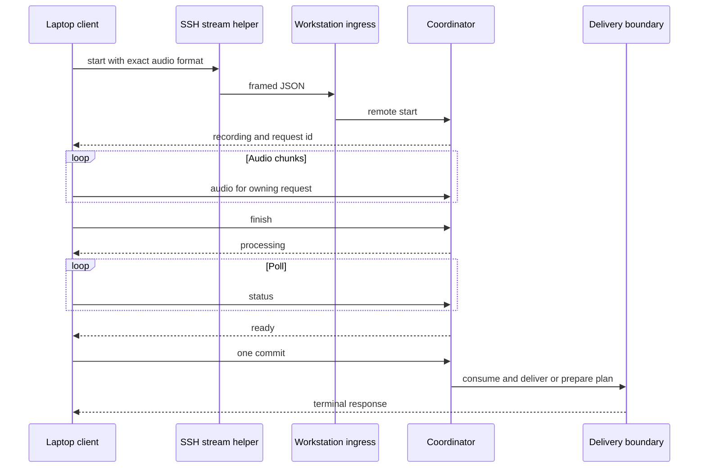
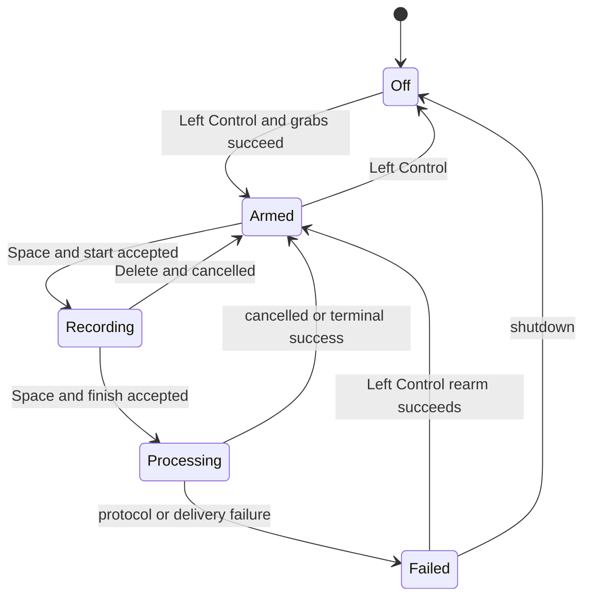

# Remote dictation and target-safe delivery

This boundary turns local X11 controls or laptop audio into one coordinator-owned operation, then delivers finalized text exactly once. The shared transcription and history path is documented in [Dictation pipeline](dictation-pipeline.md); installation lifecycle and rollback belong in [Build, install, and Check](../operations/build-install-check.md).

## Ownership and entrypoints

| Surface | Responsibility |
|---|---|
| `remote::RemoteIngress::start/shutdown` | Create, serve, and identity-check the workstation Unix socket; frame and validate protocol v1; bind requests to connections; dispatch only through `TranscriptionCoordinator`. |
| `actions::{start,finish}_remote_operation` and coordinator `remote_*` methods | Enforce global local/remote exclusivity, audio/sample/lifetime limits, processing, cancellation, ready-value ownership, and consuming commit. |
| `handy-remote-stream.py` | SSH-invoked, policy-free, bidirectional byte bridge between stdio and the app socket. |
| `handy-remote-client.py` | Laptop X11 state machine, PipeWire capture, SSH transport, strict response validation, Herdr window gate, and optional one-shot local injection. |
| `cli::running_instance_command` and coordinator `start_or_stop` | Parse qq/Herdr semantic controls, validate explicit panes only for an idle start, and preserve local/remote ownership. |
| `target_binding.rs` | Local Auto focus capture, explicit start-bound pane storage, and remote start/commit Herdr session identity checks. |
| `clipboard.rs`, `input.rs` | Herdr, direct typing, clipboard paste, external script, optional clipboard copy, and submit-key effects. |

`lib.rs` starts ingress as managed application state; the socket is not a Tauri command and exposes no TCP listener. Installed remote entrypoints are `~/.local/bin/handy-remote-stream.py` and laptop-side `handy-remote-client.py`. The workstation application itself is kept ready by `handy.service`; no workstation key bridge is installed.

## Protocol v1

Each message is a 4-byte unsigned big-endian payload length followed by one UTF-8 JSON object. The frame is **1–65,536 bytes**; all tagged request objects deny unknown fields and require `version: 1`.

| Request | Required body and valid transition | Response |
|---|---|---|
| `start` | `audio={format:"s16le",sample_rate:16000,channels:1}`; optional `delivery_mode` is `herdr` by default or `local` | `recording` plus app-minted `request_id` |
| `audio` | Owning `request_id`; `pcm` signed i16 samples. Client chunks are 1–4,800 samples; coordinator caps a request at 9,600,000 samples, ten minutes. | `accepted` |
| `finish` | Owning recording request | `processing` |
| `status` | Owning request | `recording`, `processing`, `ready`, `cancelling`, or terminal status |
| `cancel` | Owning nonterminal request | `cancelled` or `cancelling` |
| `commit` | Owning `ready` request; consumes the staged value | terminal `succeeded`/`failed`; only local mode may return `injection` |

Responses contain `version`, `status`, and optional `request_id`, `error`, or `injection`. `injection={text,submit_key}` is present only in the one successful local-mode consuming commit. Text is nonempty and at most 8,192 UTF-8 bytes after optional workstation-owned trailing space; `submit_key` is `enter`, `ctrl_enter`, `cmd_enter`, or null. Status polls never expose transcript text.

One connection owns at most one active request, but may run sequential requests. `RemoteIngress` gives each accepted peer a `connection_id`; `ConnectionSession::begin` stores the app-minted request ID, `authorize` requires the exact `(connection_id, request_id)` capability, and `retire` clears it only after terminal state. The coordinator independently matches the same owner. At most eight socket connections run concurrently. A 30-second read timeout is harmless while idle; during an active request it disconnects and cancels. Each request expires after ten minutes. Terminal status is retained only for the owning connection/request for 60 seconds, with at most eight terminal records.

Malformed, truncated, zero/oversized, wrong-version, unknown-field, stale, replayed, cross-owner, duplicate, early, and late messages receive an error where possible and close the connection. Disconnect during recording cancels immediately; during processing it requests cancellation and remains `cancelling` until the worker completes. Recording expiry cancels, processing expiry follows that same deferred cancellation, and ready expiry discards staged output and releases the pipeline. Finish-before-audio and early commit are rejected without transferring authority. A consuming commit removes `ready` before delivery, preventing replay; terminal response retires the connection-local request so sequential reuse is possible.



*The owning connection carries audio through a staged, one-shot commit; SSH only transports bytes.*

## Local controls and remote PTT

### Workstation q mode

qq/Herdr owns workstation q mode and invokes `handy --toggle-transcription --herdr-pane "$HERDR_PANE_ID"` or targetless `handy --cancel` against an already-running instance. The app grabs no workstation mode key. These controls are fire-and-forget: malformed or premature forwarding is ignored, and process lifecycle/readiness belongs to `handy.service`, not to the command.

An explicit pane is strictly validated only when the command starts an idle recorder. A stop ignores its supplied pane and keeps the original start target; busy processing and remote-owned stages ignore the toggle. Cancel affects only workstation-local work. The app-side realtime prepare/armed signal protocol remains dormant compatibility behavior, described in [Dictation pipeline](dictation-pipeline.md#input-timing-and-local-controls), but the installed workstation service does not drive it.

### Remote laptop client

The user service starts in `off`; Left Control arms and dynamically grabs Space/Delete. Space starts or finishes; Delete cancels; Left Control exits. States are `off`, `armed`, `recording`, `processing`, and `failed`; notifications are advisory. Capture configuration must invoke an absolute `pw-record`, exactly declare 16 kHz, mono, signed-16 format, and stream to stdout. SSH host/helper strings are allow-listed, executable paths are absolute, and config rejects unknown or mode-incompatible fields.



*The laptop remains armed across requests, but every protocol or effect ambiguity fails the current request closed.*

## Target semantics and delivery

### Local workstation Herdr

Every successful local start mints a recording token. `StartTarget::Auto` calls `begin_auto_capture` and asynchronously captures the focused pane only when Herdr binding is enabled and the active X11 window title is `herdr`. `StartTarget::ExplicitPane` calls `begin_explicit_target` and synchronously stores the validated public pane without consulting focus, X11, or Herdr session state. `CaptureOutcome` is `Legacy`, `Bound(pane_id)`, or `Failed(reason)`; up to eight token results are retained. Stop consumes the token associated with that recording and never recaptures or replaces its target. A bound or failed capture **never falls back** to OS input. Bound delivery uses exactly that start-selected pane, collapses CR/LF to spaces, and optionally includes one trailing carriage return in the same `herdr pane send-text` call.

### Remote Herdr

Remote start captures no pane. It captures an immutable `HerdrSessionIdentity`: status version/protocol/session plus absolute owned socket path, device/inode/UID, peer PID/UID/GID, and `/proc` process start time. At commit, the laptop first requires the same start-time Ghostty window ID/PID/title/class to remain active. The workstation re-observes exact Herdr identity; mismatch fails before an effect. Only then does it take one bounded snapshot, require one unique valid focused pane (`w…:p…`, ASCII, max 64 bytes), freeze it, and issue at most one literal send. Remote Herdr therefore follows **commit-time session focus**, unlike workstation-local start-bound targeting.

### Laptop-local injection

Local mode does not inspect Herdr and saves no start target. Immediately before commit and again before injection, the laptop requires one readable X11 focus. Commit consumes the ready text and returns the bounded plan. The client releases its dynamic Space/Delete grabs, marks the effect attempted, invokes absolute `xdotool` once with `type --delay 0 --clearmodifiers -- TEXT`, then at most one submit-key invocation, and reacquires grabs before returning to armed. The recipient is whichever window is focused at effect time. A failed second focus check injects nothing after consuming the handoff; adapter failure, submit failure, or grab-reacquisition failure enters visible failed state and never retries or falls back. Blank successful output never commits; oversized output cannot form a plan and fails before injection. Synthetic typing, Unicode, layouts, IMEs, and application acceptance remain best-effort.

### Ordinary local delivery

Without a bound Herdr outcome, `clipboard::paste` applies optional trailing space, then routes by `PasteMethod`: `direct`, `ctrl_v`, `ctrl_shift_v`, `shift_insert`, `external_script`, or `none`. Direct Linux typing selects configured `TypingTool` (`auto`, `wtype`, `kwtype`, `dotool`, `ydotool`, `xdotool`) before Enigo fallback.

Clipboard paste first snapshots existing text, or an image when no text exists. On Wayland it prefers external `wl-copy` when available; otherwise it uses the Tauri clipboard plugin. After the configured pre-paste delay and key chord, it waits the post-paste delay, restores prior text/image, or clears the temporary transcript if the clipboard was initially empty. Initial write/tool failures propagate; restoration is best-effort and does not select another target. External script receives the text and must be configured. Auto-submit runs only when delivery is not `none`; optional clipboard copy occurs after successful delivery. There is no target-changing fallback after a Herdr decision.

## Security, invariants, and failures

- `$XDG_RUNTIME_DIR` must be an app-user-owned directory. `qq-dictation/` is mode `0700`; `remote.sock` is `0600`, owned by the app user, and peers must match via `SO_PEERCRED`. Stale sockets are removed only after type/owner/connect and inode rechecks; shutdown removes only the originally bound inode.
- SSH is the remote authentication boundary. The helper validates the owner-only socket but adds no credential or policy. Compromise of the same Unix user, SSH account, X11 session, configured tools, or Herdr process is outside this boundary.
- The coordinator is the sole operation authority: remote cannot overlap local work, and disconnect/cancel/lifetime cleanup retires ownership.
- Ready text is not observable before consumption. Commit and local injection are never retried after the irrevocable/effectful boundary; response loss or tool timeout can be effect-uncertain but cannot duplicate text.
- Herdr subprocesses have hard timeouts. Identity, snapshot, focus, protocol, and tool failures terminate delivery rather than choosing another target.
- Live SSH, PipeWire, X11 grabs/focus, Ghostty/Herdr behavior, systemd user sessions, and application rendering are integration assumptions, not established by unit tests.

## Installation and change surfaces

`install-remote-workstation.py` atomically installs only the mode-0755 SSH stream helper under an operator-owned home, rejects foreign/non-regular destinations, and preserves timestamped backups; it intentionally does not modify Herdr or SSH configuration. `install-remote-laptop.py` validates a complete Herdr or local config, creates mode-0600 config under a mode-0700 directory, refuses silent config overwrite, installs the mode-0755 client and mode-0644 `handy-remote-client.service`, then daemon-reloads, enables, restarts, and verifies a stable running PID. Both installers use atomic replacement and reject unsafe ownership/type.

The local installer retires `handy-ptt.service` and its active bridge script, then installs `handy.service`, which directly starts `handy --start-hidden` with `DISPLAY=:0`, restarts on failure after one second, and is wanted by `default.target`. Existing legacy backup artifacts are retained. The laptop's separate remote-client service remains unchanged. Operational rollback and the fact that multi-file/service installation is not one transaction are covered in [Build, install, and Check](../operations/build-install-check.md).

When changing this boundary:

- Protocol: update Rust request/response serde types and bounds, Python encoder/decoder/state transitions, `docs/remote-dictation-protocol.md`, and both Rust/Python negative tests; preserve strict ownership and no-retry semantics or version the protocol.
- Delivery mode or injection plan: update `RemoteDeliveryMode`, coordinator staging/commit, `RemoteInjectionPlan`, laptop config validation/injector, installer arguments, generated operational docs, and tests.
- Herdr identity/pane schema: update status/snapshot parsers, equality and bounds tests, and local-versus-remote targeting tests; do not merge the two capture models.
- Workstation q-mode control: update `CliArgs`, `running_instance_command`, `StartTarget`, coordinator classification, target capture, qq/Herdr callers, and installer/service tests. Do not add a workstation key grab or make a stop depend on its caller's pane.
- Remote laptop PTT key/handshake: update `handy-remote-client.py`, its service/config docs, installer, and Python tests. `Control_L` is current on the laptop only.
- Local paste method/tool: update settings enums/defaults, `clipboard.rs` routing, generated bindings and settings UI described in [Frontend and IPC](../frontend/app-and-api.md).

## Focused tests and narrow validation

```bash
cargo test --manifest-path src-tauri/Cargo.toml cli::tests
cargo test --manifest-path src-tauri/Cargo.toml transcription_coordinator::tests
cargo test --manifest-path src-tauri/Cargo.toml remote::tests
cargo test --manifest-path src-tauri/Cargo.toml target_binding::tests
cargo test --manifest-path src-tauri/Cargo.toml clipboard::tests
python3 -m unittest tests.test_install_local_service
python3 -m unittest tests.test_remote_helpers
python3 -m unittest tests.test_remote_laptop_client
python3 -m unittest tests.test_remote_installers
```

Named contract tests include coordinator `remote_audio_chunks_and_total_are_bounded_without_truncation`, `terminal_status_is_bound_to_connection_and_expires`, and `ready_retains_exclusive_processing_ownership_until_one_commit_attempt`; ingress `read_timeout_is_tolerated_only_between_idle_session_frames` and `local_injection_is_framed_only_on_one_consuming_owner_response`; and Python `test_start_audio_finish_ready_commit_and_terminal_states_are_ordered`, `test_local_focus_refusal_before_or_after_handoff_never_injects`, `test_local_adapter_failure_is_one_marked_attempt_without_retry_or_fallback`, `test_local_reacquisition_failure_after_injection_fails_without_repeat`, and `test_window_mismatch_at_ready_sends_no_commit_and_releases_resources`. Remote laptop PTT changes must also update its mode-key, grab, and state-transition suites. Changes to the dormant app signal compatibility seam require `signal_handle::tests` and coordinator `mode_space_and_delete_apply_only_to_local_owner`.

For workstation semantic controls, retrieve coordinator tests `semantic_start_validates_and_retains_the_exact_explicit_target`, `semantic_stop_and_busy_stages_never_inspect_the_callers_target`, and `targetless_local_cancel_is_idempotent_and_remote_isolated`, plus CLI argument-pairing tests and `target_binding::tests::captures_are_per_recording_and_evicted_in_order`. The local service suite checks bridge retirement, repeated migration, exact single-process executable/readiness matching, settings preservation, and direct hidden startup.

Together these cover strict framing/version/bounds, socket ownership and replacement, connection/request ownership, terminal expiry, coordinator lifecycle, pane/identity validation, one-shot commit/injection, the remote laptop X11 state machine and grabs, semantic workstation controls, short writes, config constraints, atomic installs, and service health. For a protocol-only change, start with the remote Rust filter plus `test_remote_helpers` and `test_remote_laptop_client`; add installer tests only when installed files/config/services change. Do not claim end-to-end delivery until manually proven with real SSH, X11, PipeWire, Herdr/Ghostty, and the target application.
